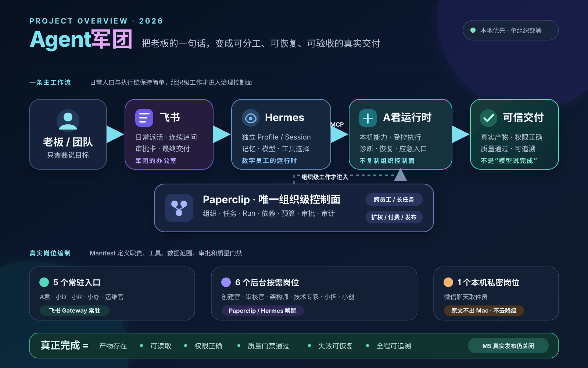
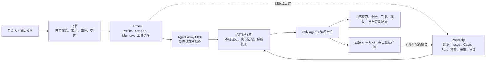
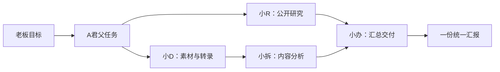
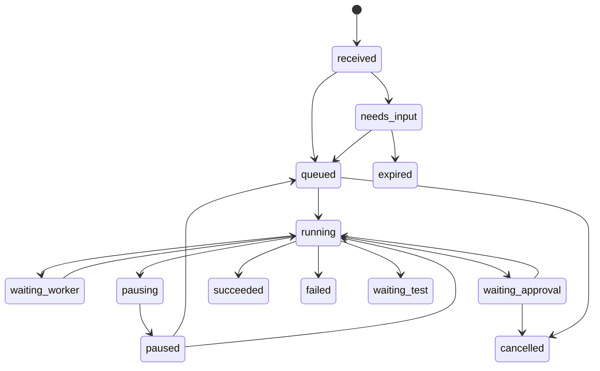

# Agent军团项目全景指南

> 文档定位：项目导航与接手指南，不替代 PRD、架构、契约和验收账本中的唯一事实来源  
> 适用读者：项目负责人、产品/架构/开发/测试人员，以及准备接手任务的 Agent  
> 基线日期：2026-08-04  
> 阅读结果：理解项目为什么存在、各系统如何分工、任务怎样流动、代码在哪里、当前做到哪一层、如何安全修改和验证



## 先记住这六句话

1. **Agent军团是一套本地优先的数字员工组织系统，不是一组聊天机器人。** 它追求的是“真实任务有负责人、有权限、有执行、有产物、有恢复、有审计”，不是让多个模型同时说话。
2. **飞书是日常办公室，Hermes 是员工运行时，Paperclip 是唯一组织级控制面，A君是本机能力与恢复入口。** 四者职责不能互相替代。
3. **岗位真相在版本化 `AgentManifest`，组织治理真相在 Paperclip，会话与运行历史在 Hermes，业务 checkpoint 与产物验证在业务存储。** 飞书消息和网页卡片都只是投影。
4. **低风险单员工任务可以直达执行器；跨员工、长任务、预算、扩权、公开发布等工作才进入 Paperclip。** 不能为“看起来统一”给每条消息增加组织级中转。
5. **代码通过、live 已加载、外部平台已调用、负责人已验收是四件不同的事。** 本项目所有完成结论都必须说明证据位于哪一层。
6. **当前真实发布仍关闭。** M5 已具备大量本地契约、Fake E2E、媒体产物和安全门禁，但 Publisher 仍为 `disabled`，活动未批准，不能写成已经在抖音或小红书真实发布。

如果只剩一分钟，记住这张图：



## 项目到底解决什么问题

普通 AI 助手擅长回答问题，却不天然具备稳定承担公司工作的条件。Agent军团补的是这些组织能力：

- 谁负责什么，谁明确不负责什么；
- 每个岗位能读什么、能写什么、能调用什么工具；
- 任务如何创建、去重、暂停、恢复、失败升级和最终关闭；
- 产物是否真实存在、可读、权限正确，而不是模型自称完成；
- 新员工如何从草案、审核、受限测试进入正式上岗；
- 外发、公开发布、付费、扩权和敏感数据访问如何由真人把关；
- 如何从真实工作记录中改进或淘汰岗位，而不是无限增加空壳 Agent。

项目当前服务的主要用户是 A君本人和少量内部协作者，默认本地或单组织部署，并发目标是 3–10 个任务。它暂时不做公共 SaaS、多租户计费、Agent 商城，也不承诺无人值守执行所有高风险动作。长期目标、范围和成功标准以[总 PRD](../tasks/prd-agent-army-master.md)为准。

## 如何判断哪份资料才算数

这是一座快速演进的仓库，概览、历史方案和 live 状态可能处于不同时间点。发生冲突时，按下表定位唯一事实来源，不要凭一篇旧说明猜测：

| 你要判断的问题 | 应读取的事实来源 | 不能替代它的材料 |
| --- | --- | --- |
| 项目为什么做、长期边界 | [总 PRD](../tasks/prd-agent-army-master.md) | README 中的一段摘要 |
| 当前里程碑做什么 | 对应的 `tasks/prd-*.md` | 历史计划或聊天记录 |
| 当前仓库入口和阶段摘要 | [根 README](../README.md) | 旧版项目说明 |
| 系统组件与数据归属 | [系统架构](./architecture/system-architecture.md) | UI 展示或进程名称 |
| 字段、状态与完成语义 | [核心契约](./contracts/core-contracts.md) | 某个适配器的私有字段 |
| 为什么选择当前方案 | [ADR 目录](./adr/) | 仅描述“现在怎么做”的代码注释 |
| 是否真的完成 | [验收账本](./reviews/) | 测试绿灯、健康接口或模型列表 |
| 未完成工作如何继续 | [当前交接单](./handoffs/current/) | 旧里程碑总结 |
| 此刻进程是否加载了新代码 | 监听端口、PID、cwd、release、HTTP 回读 | Git 工作树或 README 声明 |

本指南只负责把这些事实串成一张地图。动态状态发生变化时，应更新唯一事实来源，本指南保留稳定解释和指向链接。

## 四个核心系统的职责

| 系统 | 核心职责 | 它不负责什么 |
| --- | --- | --- |
| 飞书 | 用户派活、连续追问、审批卡、状态投影、最终交付；群内只响应授权的 @ | 不保存业务 checkpoint，不判断任务完整成功，不成为组织数据库 |
| Hermes | 每个员工独立 Profile、Session、Memory、模型、Prompt、Skills、MCP、单次执行与运行历史 | 不复制 Paperclip 的长期组织任务、预算和审批，不保存业务产物真相 |
| Paperclip | 公司、岗位、汇报关系、组织级 Issue/Case/Run、依赖、heartbeat、预算、审批、暂停恢复与审计 | 不替代业务 Agent 的质量门禁，不承接每一条普通聊天，不负责连续对话体验 |
| A君运行时 | 本机组件、账号与内容接入、岗位路由、受控执行、任务投影、诊断、恢复和应急操作 | 不创建第二套组织树、排程、预算、审批中心或长期军团队列 |

辅助系统的定位也很明确：

- `AgentManifest` 是岗位发布基线；
- Agent Army MCP 是 Hermes 访问既有军团真相的受控桥，不是新的任务库；
- 小D等业务应用负责领域执行与产物；
- `integrations/` 隔离飞书、Paperclip、Hermes、模型、平台和发布细节；
- `packages/` 只保存至少两个真实消费者共享的稳定契约或客户端；
- Publisher Gateway 是无模型、确定性的外部写入边界，默认关闭；
- 本地 AI 网关只提供模型能力与资源调度，不创建业务任务或审批。

## 数据真相放在哪里

掌握这个表，基本就不会在项目里造出第二套状态：

| 数据 | 唯一真相 | 说明 |
| --- | --- | --- |
| 岗位、职责、任务类型、工具白名单、质量门禁 | `agents/*/manifest.json` | 只有正式 Manifest 为 `active` 才能进入活动名册 |
| 系统可接受的岗位字段 | `agents/schema/agent-manifest.schema.json` | Manifest 与运行配置必须通过契约检查 |
| 公司、组织、组织级任务、预算、审批、审计 | Paperclip | A君只做投影和受控适配 |
| Hermes Profile、会话、记忆、模型与单次执行历史 | 各员工 Hermes Home | 默认 Home 与隔离 Profile 不能混用 |
| 标准业务任务、一次性审批、阶段与本机执行结果 | A君/业务 TaskStore | 当前支持统一生命周期和 SQLite 持久化 |
| 小D媒体阶段、转录、确认稿与飞书交付证据 | 小D业务存储 | Paperclip 状态不能覆盖产物验证结果 |
| M5 活动阶段、分支、blocker、Run 和 Work Product | Paperclip Project/Case/Issue/Run | 内容插件和 Publisher 不能保存第二份活动状态 |
| M5 付费工具幂等与 Provider 费用草稿 | 内容自治插件 | 确认后关联 Paperclip 成本事件 |
| 发布 attempt、回执、指标和发布硬停闩 | Publisher Gateway 账本 | CampaignGrant 和 Cron 仍以 Paperclip 为准 |
| 凭据实际值 | 系统密钥链、Paperclip Secret 或受控本机存储 | 不进入 Manifest、任务、Prompt、日志和文档 |
| 用户看到的状态 | 飞书和 A君页面 | 只是投影，不是完成证明 |

## 任务怎样从一句话变成可信交付

### 低风险单员工任务

适用于输入完整、单岗位、低风险、可立即完成的工作，例如公开网页研究或本地音视频整理：

```text
飞书提出目标
→ Hermes 延续当前会话并选择受控工具
→ Agent Army MCP / A君创建带幂等键的业务任务
→ 指派一个正式岗位执行
→ 业务应用保存 checkpoint 与产物
→ 质量门禁验证存在性、可读性、权限和业务内容
→ 回原飞书会话交付
```

这种任务不应只为了“统一记录”而创建 Paperclip Issue。它仍然必须有任务 ID、幂等键、真实状态、产物引用和失败原因。

### 组织级或高风险任务

满足以下任一条件时进入 Paperclip：新 Agent、账号或权限扩展、公开发布、付费或预算、跨 Agent 协作、长任务调度、暂停/终止、组织级审计。

```text
飞书提出目标
→ A君识别治理原因并生成最小脱敏任务信封
→ Paperclip 建立或关联 Issue / Case / Run
→ Hermes Profile 按指派执行
→ A君只把阶段摘要、费用、产物引用和失败分类回报 Paperclip
→ 业务存储继续保存 checkpoint 与完整质量证据
→ 审批或质量门禁通过后交付
```

投影到 Paperclip 的内容不能包含原始聊天全文、媒体、字幕、Cookie、token、浏览器会话或业务 checkpoint。

### 多员工总任务

A君可以用 `mission_create` 建立一个父任务和最多 11 个受限子任务。子任务用稳定 `key` 标识，通过 `depends_on` 形成无环依赖图；无依赖任务并行，活动并发最多 4 个。汇总岗位必须等待依赖任务终结，并只使用真实产物形成最终汇报。



父任务不能用“子任务已接单”当成完成，也不能把缺失或失败的来源产物编进汇报。

### 失败恢复与技术修复

普通员工失败后先创建运维官任务。安全条件满足时只自动重试一次；仍失败或不可重试时，升级技术专家。技术专家先区分代码故障、授权/权限、输入/来源、外部瞬时故障和未知故障，只有真实存在的代码与测试路径才进入隔离修复。

```text
业务失败
→ 运维官读取脱敏健康事件
→ 诊断 / 低风险恢复 / 最多一次安全重试
→ 仍失败则技术专家只读分流
→ 代码类问题在受控 worktree 修改并测试
→ 候选修复进入待发版
→ 冻结新的不可变 release 并验证
→ 才能视为 live 修复
```

“改完源码”只得到候选修复；没有冻结、切换和回读新 release 时，不能声称正式服务已修复。

### 新员工上线

```text
飞书提出长期岗位需求
→ 创建官生成 AgentProposal 草案
→ 架构师检查复用与边界
→ 审核官检查权限、预算和外部动作
→ Paperclip 保存审核与组织身份
→ A君准备受限能力，Hermes 创建隔离测试 Profile
→ 一条白名单验收任务生成真实产物
→ 负责人再次明确激活
→ 正式 Manifest 变为 active 并进入路由
```

草案、Prompt、头像、测试实例或 Paperclip Agent 记录都不能单独代表员工已上岗。正式上岗至少需要版本化 Manifest、独立 Profile、最小权限、真实任务、可验证产物和失败路径。

## 当前员工名册

正式军团使用 11 个 `paperclip-hermes` 岗位；另有一个只在本机处理私密数据的微信聊天取件员。任务协调官已经并入 A君并退役。是否常驻以 Manifest 的 `interaction.directFeishu` 为准。

| ID | 显示名 | 主要职责 | 运行方式 | 直接飞书 |
| --- | --- | --- | --- | --- |
| `ajun` | A君·军团总管 | 理解目标、路由员工、建立多人任务、持续跟进和统一交付 | Paperclip + Hermes | 常驻 |
| `xiaod` | 小D | 音视频获取、转录、整理、确认稿、素材证据 | Paperclip + Hermes + 小D应用 | 常驻 |
| `intel-researcher` | 小R | 公开网页、PDF、动态网页、GitHub 和主题研究 | Paperclip + Hermes | 常驻 |
| `office-assistant` | 小办 | 办公汇报、统一交付、受限知识归档 | Paperclip + Hermes | 常驻 |
| `operator` | 运维官 | 脱敏健康检查、巡检、低风险恢复 | Paperclip + Hermes | 常驻 |
| `creator` | 创建官 | 把岗位需求收敛为可审核草案 | Paperclip + Hermes | 按需 |
| `reviewer` | 审核官 | 权限、范围、内容与发布门禁审核 | Paperclip + Hermes | 按需 |
| `architect` | 架构师 | 事实—判断—候选方案三层架构分析 | Paperclip + Hermes | 按需 |
| `technical-expert` | 技术专家 | 故障分流、只读诊断、受控代码修复 | Paperclip + Hermes | 按需 |
| `video-content-analyst` | 小拆 | 视频结构、画面证据、表现复盘 | Paperclip + Hermes | 按需 |
| `content-creator` | 小创 | 脚本、平台草稿、图片、配音与渲染任务 | Paperclip + Hermes | 按需 |
| `wechat-chat-retriever` | 微信聊天取件员 | 临时授权范围内只读本机微信 Vault，并用本机模型输出脱敏分析 | A君本机 + Qwen3.5 | 禁用 |
| `task-coordinator` | 任务协调官 | 历史任务接收与协调职责 | 已并入 A君 | 退役 |

五个常驻 Gateway 是 A君、小D、小R、小办和运维官。其余正式岗位保留独立 Profile、SOUL、模型和最小 MCP/Paperclip 作用域，由 Paperclip 官方 `hermes_local` Adapter 按需唤醒。

11 个正式岗位当前 Manifest 主文本模型为 `deepseek/deepseek-v4-flash`，回退链为空。配置、Profile、Adapter 和 live roster 对账不等于已完成新的付费 DeepSeek 探针。微信私密岗位固定使用回环 Qwen3.5，不允许云端或 4070 回退。

岗位的最终定义必须直接读取 [`agents/`](../agents/)；岗位概览见 [`agents/README.md`](../agents/README.md)，Schema 见 [`agents/schema/agent-manifest.schema.json`](../agents/schema/agent-manifest.schema.json)。

## 代码仓库怎么读

```text
agent-agent/
├── apps/           可独立启动和验收的业务应用
├── agents/         岗位 Manifest、Prompt、评测与岗位卡
├── integrations/   外部平台、模型和受控业务适配层
├── packages/       多消费者共享契约与客户端
├── ops/            launchd、部署、监控、备份和恢复
├── tasks/          总 PRD 与里程碑 PRD
├── docs/           架构、契约、设计、ADR、验收和交接
├── designs/        可运行 UI 原型与视觉资产
├── scripts/        根级架构检查和 affected test 路由
└── work/           本机运行产物、release、日志与证据；通常不提交
```

### 主要应用

| 目录 | 作用 | 默认入口 |
| --- | --- | --- |
| [`apps/ajun-runtime`](../apps/ajun-runtime/) | A君模块化单体：任务生命周期、岗位路由、MCP、Paperclip 适配、本机能力、控制台与恢复 | `127.0.0.1:4321` |
| [`apps/xiaod-media-transcriber`](../apps/xiaod-media-transcriber/) | 小D媒体获取、字幕/ASR、整理、任务阶段与飞书交付 | `127.0.0.1:4318` |
| [`apps/mac-worker`](../apps/mac-worker/) | 私人云办公室到 Mac 工作间的出站短租约桥 | 无固定 UI |
| [`apps/animated-chart`](../apps/animated-chart/) | M5 固定 Remotion Composition 与受控渲染 | Remotion Studio |
| [`apps/boom-monitor`](../apps/boom-monitor/) | 独立监测应用；通过集成边界接入，不成为任务真相 | 见其 README |

### 主要集成与共享包

| 目录 | 作用 |
| --- | --- |
| [`integrations/hermes`](../integrations/hermes/) | Manifest 到 Hermes 的映射、Profile 配置器、Gateway 补丁和技能白名单收敛 |
| [`integrations/feishu`](../integrations/feishu/) | 飞书入口、权限边界和真实接线说明 |
| [`integrations/access`](../integrations/access/) | 账号连接和通用访问能力 |
| [`integrations/local-ai`](../integrations/local-ai/) | 本地 AI 统一能力网关、桌面增强节点、检索引擎 |
| [`integrations/m5-kernel`](../integrations/m5-kernel/) | M5 Campaign/Case 领域内核和受控 Paperclip 适配 |
| [`integrations/paperclip/m5-content-pipeline`](../integrations/paperclip/m5-content-pipeline/) | M5 Pipeline、Routine、迁移、对账和 Fake E2E |
| [`integrations/paperclip/plugins/content-autonomy`](../integrations/paperclip/plugins/content-autonomy/) | StepFun 多模态、FFmpeg、Remotion、内容产物与费用幂等插件 |
| [`integrations/publishing/m5-publisher-gateway`](../integrations/publishing/m5-publisher-gateway/) | 无模型、默认关闭的确定性发布与指标网关 |
| [`packages/m5-contracts`](../packages/m5-contracts/) | A君、Pipeline、插件和 Publisher 共用的稳定 M5 契约 |
| [`packages/paperclip-client`](../packages/paperclip-client/) | Paperclip HTTP transport、Run 身份和语义端点 |

A君继续采用 Node.js ESM 模块化单体，不因为代码多就拆成微服务。`server.js` 只启动 `startRuntime()`；构造、HTTP handler、监听、后台服务、任务生命周期、M5 领域和平台适配被分开测试。共享包不能反向依赖 `apps/` 或 `integrations/`。这个决策见 [ADR-0010](./adr/0010-modular-monolith-contract-kernel-and-workspaces.md)。

## 核心契约和状态机

### AgentManifest

每个员工至少定义：稳定 ID、名称、部门、职责、非职责、可接任务类型、工具白名单、数据范围、审批策略、质量门禁、Prompt 引用、运行时 Profile、执行应用、负责人和状态。运行时能力还声明模型、Skills、MCP 工具、飞书/Paperclip toolset 和本地 AI 能力。

三个容易误判的状态：

- `modelConfigured` 只表示写入了模型选择；
- `credentialedTransportVerified` 才表示真实无副作用调用通过；
- `ready` 还要求模型与入口均有真实闭环证据。

### TaskContract

标准任务必须有 `taskId`、`taskType`、`idempotencyKey`、请求方、来源、承接岗位、输入、状态、尝试次数和时间；长任务还应有阶段、checkpoint、预算、审批、产物和标准错误。



`waiting_test`、`succeeded`、`failed`、`cancelled`、`expired` 是当前 attempt 的终态；重试要新建 attempt 并保留历史。`currentStage` 是领域阶段，不是组织级状态。TaskStore 只能原子持久化，不能绕过生命周期 Module 任意覆盖 `status`。

### ArtifactContract

关键产物必须记录所属任务、类型、来源引用、位置、访问范围、校验值和验证结果。完整成功至少要求：

- 产物存在且非空；
- 可以读取，内容类型正确；
- 预期接收人有权限；
- 岗位质量门禁通过；
- 外部副作用有可核验证据，而不是按钮点击或成功文案。

### ApprovalContract

一次性、范围明确且不改变组织能力的决定由飞书卡片 + A君本机审批闭环；新 Agent、扩权、账号连接、公开发布、付费预算、跨 Agent 长任务、暂停终止和组织级审计使用 Paperclip。两条路径都必须在执行前核验批准人、动作、范围、有效期和幂等性。

全部契约见[核心契约](./contracts/core-contracts.md)。

## M5 内容自治是怎样工作的

M5 的目标是用一条 7 天内容活动验证高权限内容生产：

```text
选题 → 研究 → 证据 → 脚本 → 素材/配音 → 渲染 → 审核
→ 平台适配 → 发布 → 核验 → 2h/24h/72h 指标 → 复盘 → 学习提案
```

它坚持三个分离：

1. Paperclip 保存活动、Case、Issue、Run、依赖、预算、审批和恢复；
2. Hermes 岗位执行需要模型判断的工作；
3. Publisher Gateway 无模型，只消费已批准、已验证、哈希匹配的内容版本执行外部写入。

候选源码目前声明 16 个阶段、18 个 Routine（17 个阶段/分支 Routine + 1 个 daily）和 6 个无模型控制器；当前 Paperclip live 仍是 15 阶段、17 个有效 Routine 和 5 个控制器。活动草案为 `0/14`，Cron 关闭，Publisher `4390` 为 `disabled`。候选结构、live 结构和真实活动是三层不同状态。

并行阶段把研究、证据、画面分析、生图和配音放入独立 Case。无模型 `parallel` 控制器只有在必要 Work Product 全部存在、可读、非空且 blocker 清零后才放行渲染。模型岗位不能自行修改依赖、预算、审批和汇聚结论。

真实发布的最后一道边界是 [`m5-publisher-gateway`](../integrations/publishing/m5-publisher-gateway/README.md)：

- 默认 `disabled`，不能通过普通环境变量打开 production；
- 发布前验证 CampaignGrant、账号引用、日期、内容哈希、机器审核、配额和预算；
- 外部调用前持久化 attempt，结果不确定时停止并要求人工核对，绝不盲目重发；
- 验证码、身份切换、风控、违规、未知页面立即暂停活动和 Cron；
- 成功必须得到真实内容 ID、结果页、账号核验和 selector/观察证据；
- 指标读取使用独立授权、runner 和 Profile，不能复用发布授权。

当前已经有本地 Fake E2E、真实本地 MP4、模拟 PublishReceipt/MetricSnapshot、媒体规格和恢复证据，但所有相关账本都明确 `externalPublished=false`。M5 的准确状态必须以 [M5 PRD](../tasks/prd-m5-high-autonomy-content-operations.md) 和 [M5 验收账本](./reviews/m5-high-autonomy-content-operations/acceptance.md)为准。

## 本地 AI 能力系统

业务 Agent 只按能力名调用，不直接依赖模型进程。`127.0.0.1:18082` 是轻量统一控制面，负责能力声明、资源互斥、超时、取消和底层进程生命周期；Mac 是默认主节点，4070 是需要逐请求批准的可拔插增强节点。

| 能力 | Mac 默认实现 | 关键边界 |
| --- | --- | --- |
| `text.generate` / `vision.analyze` | Qwen3.5-9B MLX-VLM | 按需启动，空闲释放 |
| `video.analyze` | FFmpeg 抽帧 + Qwen3.5 | 重任务队列 |
| `audio.transcribe` | Whisper large-v3-turbo | 与 TTS 共用 speech 互斥组 |
| `audio.synthesize` | Qwen3-TTS | 按请求运行 |
| `image.generate` / `image.edit` | MFLUX + FLUX.2 klein 4B | heavy 串行；批准后可优先 4070 |
| `embedding.create` / `rerank.score` | Qwen3 Embedding/Reranker | 按需加载 |
| `knowledge.index` / `knowledge.search` | 版本化 SQLite + Embedding + Rerank | 固定模型 revision、维度和访问范围 |
| `audio.clone_authorized` | 未安装 | 失败关闭 |
| `video.generate` | 网络 Provider | 外发与费用审批后才允许 |

统一调用入口：

```http
POST http://127.0.0.1:18082/v1/invoke
Content-Type: application/json

{
  "capability": "vision.analyze",
  "request_id": "stable-local-id",
  "input": {
    "prompt": "识别截图中的任务标题",
    "imagePath": "/absolute/path/to/image.png"
  }
}
```

4070 节点只能通过私网地址、至少 32 字符 Bearer token、Mac 单地址 allowlist 和请求级 `approved=true` 调用。附件传 Base64、大小和 SHA-256，不传 Mac 文件路径；返回产物再次校验。节点断线时默认回 Mac，显式指定离线节点则返回真实失败。

Qwen3.6 35B 的 `18080` 是默认禁用的显式质量候选，不进入任何 Agent 自动路由。完整契约见[本地 AI 能力系统](./architecture/local-ai-capability-system.md)，运维命令见 [`ops/local-ai/README.md`](../ops/local-ai/README.md)。

## 部署形态与端口

### 当前本机形态

| 端口 | 服务 | 暴露边界 |
| --- | --- | --- |
| `3100` | Paperclip | 本机控制面，不直接暴露公网 |
| `4318` | 小D媒体应用 | loopback，本地调试与执行 |
| `4321` | A君运行台/API | loopback 或受控局域网读取；日常派活仍在飞书 |
| `4390` | M5 Publisher Gateway | loopback，默认 `disabled` |
| `18080` | Qwen3.6 35B 候选 | loopback，默认不进入路由 |
| `18081` | Qwen3.5-9B | loopback，按需模型服务 |
| `18082` | 本地 AI 统一网关 | loopback，轻量常驻 |
| `18083` | Windows 4070 增强节点 | 私网、鉴权、逐请求批准 |

### 私人云办公室候选形态

仓库已经实现“私人云办公室 + Mac 工作间”的部署边界：云端 Hermes/A君/Paperclip 处理飞书长连接和轻量工作，Mac 只通过出站 HTTPS 短租约领取本机能力任务。Mac 离线时任务停在 `waiting_worker`，上线后按原任务 ID 幂等继续。

这条路线尚未完成真实付费云主机、IAP 跨设备接力和 Mac 关机期间飞书持续接单验收。启用云结算或创建付费 VM 必须由负责人单独批准。详见 [`ops/hybrid-online/README.md`](../ops/hybrid-online/README.md)。

## 2026-08-04 本机运行快照

这一节是一次只读观察，不是永久状态。接手运行任务时必须重新执行后面的诊断命令。

| 证据层 | 当前观察 |
| --- | --- |
| A君 | `127.0.0.1:4321/api/overview` 返回 200；进程从不可变 release `0a49f0dc…` 启动 |
| 军团投影 | overview 返回 11 个正式 Agent、5 个常驻入口；本机私密岗位不计入正式军团数 |
| Paperclip | `127.0.0.1:3100/api/health` 返回 200，版本 `2026.722.0` |
| 小D | `127.0.0.1:4318/api/health` 返回 200 |
| Publisher | `127.0.0.1:4390/health` 返回 `disabled`、`hardStop=false`、`realConnectorsConfigured=false` |
| 本地 AI | `18082` 为 `healthy`；Mac 端 11 项正式能力报告 E2E 已验证，声音克隆和视频生成保持关闭 |
| 4070 | 配置存在，但该次快照为不可达；默认路由继续使用 Mac |
| 源码与 live | 当前工作树有未提交开发改动；不能据此推断 `4321` 已加载这些修改 |

该快照还观察到 `18080`、`18081`、`18082` 均在监听。服务策略仍以 A君能力中心和 launchd 配置为准；“端口在监听”只证明进程存在，不证明它已进入岗位路由。

## 里程碑与当前完成度

| 里程碑 | 目标 | 当前结论 |
| --- | --- | --- |
| M0 | 文档、架构、契约、规范和基线 | 已完成 |
| M1 | 小D真实飞书任务、转录、交付与失败恢复 | 已完成真实闭环 |
| M2 | Paperclip 总控、账号/内容底座、首批治理岗位与多员工协作 | 主体已完成；少数历史交接项仍保留独立验收 |
| M3 | 内容分析、创作和知识归档岗位 | 已完成并进入后续里程碑 |
| M4 | 11 岗开放任务、岗位能力深化和模型治理 | 岗位能力已实现；原本地自治控制面已由 M5 纠偏到 Paperclip/Hermes |
| M5 | 高权限内容活动、媒体生产、发布、指标与学习闭环 | 本地代码/Fake/媒体证据很深，但真实发布、真实指标和最终人工验收未完成 |

理解状态时使用下面的验证阶梯：

| 层级 | 它能证明什么 | 它不能证明什么 |
| --- | --- | --- |
| 静态/单元/契约测试 | 当前源码满足局部逻辑与接口约束 | 运行进程已经加载、外部平台可用 |
| 本地集成与 Fake E2E | 内部链路、幂等、恢复和安全停机可工作 | 真实 Provider 或真实账号成功 |
| live 进程回读 | 某个 release、端口和运行配置正在生效 | 业务产物质量、外部副作用完成 |
| 外部平台真实调用 | 飞书、模型、Paperclip 或平台在授权下实际响应 | 负责人认可最终质量 |
| 人工验收 | 业务结果符合负责人标准 | 自动替代未来持续运维 |

最近一次文档记录的根自动化基线为 `1557/1557`，且 Node 24 全量 `test`/`check` 通过；这是已有验收记录，不是本指南生成时重新跑出的结果。当前修改后应按受影响范围重新验证。

## 如何启动、检查和测试

先确认是否已有 live 服务，避免用开发进程抢占正式端口：

```bash
lsof -nP -iTCP -sTCP:LISTEN | rg ':(3100|4318|4321|4390|18080|18081|18082|18083)'
```

运行 A君开发版：

```bash
cd apps/ajun-runtime
npm test
npm run dev
```

运行小D开发版：

```bash
cd apps/xiaod-media-transcriber
npm install
npm test
npm run dev
```

根 Workspace 常用检查：

```bash
npm run runtime:fingerprint
npm test
npm run check
npm run test:affected
npm run check:architecture
npm run test:contracts
npm run test:core
```

`runtime:fingerprint` 是只读机器指纹：输出当前源码 Git/脏状态计数、关键监听 PID/cwd、A君不可变 release/payload/Git 身份和固定健康字段。它不读取 Secret，不修改服务，也不把源码通过误报为 live 已加载。

本地 AI 检查：

```bash
npm run local-ai:status
npm run local-ai:smoke
```

M5 Publisher 只读准备度：

```bash
npm run production:readiness --workspace=@agent-army/m5-publisher-gateway
```

该命令当前预期返回 `not_ready` 和非零退出码；这表示安全门禁仍关闭，不应为了“让命令变绿”绕过阻塞项。

## 运行故障应该怎么查

按这个顺序检查，能避免最常见的误诊：

1. **确认监听者。** 查端口、PID、启动时间和命令行；不要先相信页面上的绿色卡片。
2. **确认运行目录和 release。** `4321` 可能从 `work/runtime-releases-*` 的不可变包启动，而不是当前源码目录。
3. **确认真实入口。** A君看 `/api/overview`，Paperclip 看 `/api/health`，Publisher 看 `/health`，小D看 `/api/health`，本地 AI 看 `/health` 与 `/v1/capabilities`。
4. **确认数据真相。** 页面异常不等于 TaskStore 错；聊天显示成功不等于 Artifact 通过；Paperclip 状态不能覆盖业务 checkpoint。
5. **确认 Profile 作用域。** 默认 Hermes Home 与 `~/.hermes/profiles/<id>` 是不同运行环境；只设置 `HERMES_PROFILE` 不一定切换所有 CLI 状态。
6. **确认候选与 live。** 源码、配置映射、Paperclip Adapter、不可变 release 和实际 Gateway 必须分别对账。
7. **确认外部证据。** 模型列表、凭据已填或插件 `ready` 都不是一次真实调用；按钮点击也不是发布成功。
8. **再考虑修复。** 先区分代码、授权、输入、外部瞬时和未知故障；没有真实代码路径时只交付诊断。

安全的只读检查示例：

```bash
curl -sS http://127.0.0.1:4321/api/overview | jq 'keys'
curl -sS http://127.0.0.1:3100/api/health | jq '{status, version}'
curl -sS http://127.0.0.1:4390/health | jq .
curl -sS http://127.0.0.1:4318/api/health | jq '{ok}'
curl -sS http://127.0.0.1:18082/v1/capabilities | jq '{status, capabilities}'
```

## 改需求时应该从哪里下手

| 变更目标 | 第一落点 | 通常还要同步 |
| --- | --- | --- |
| 修改长期范围或成功标准 | `tasks/prd-agent-army-master.md` | README、里程碑 PRD、验收 |
| 新增或改变岗位 | `agents/<id>/manifest.json` | Prompt、Profile 映射、Schema/测试、Paperclip roster、验收 |
| 增加任务类型或状态 | `docs/contracts/core-contracts.md` | 生命周期 Module、Manifest、适配器和契约测试 |
| 修改飞书交互 | `integrations/feishu` / Hermes Gateway | 设计、移动端状态、真实飞书验收 |
| 修改 A君业务 API | `apps/ajun-runtime/src/runtime-http-handler.js` 及对应 Module | 客户端、MCP、测试和运行回读 |
| 增加外部内容平台 | 内容获取中心的 Provider/Adapter | 账号范围、能力记录、失败降级和真实只读验收 |
| 增加本地模型 | `integrations/local-ai` | 能力契约、资源组、控制策略、E2E 与 Manifest 白名单 |
| 修改 M5 领域不变量 | `packages/m5-contracts` / `integrations/m5-kernel` | A君、Pipeline、插件、Publisher 和全链回归 |
| 增加真实发布能力 | Publisher production composition | Paperclip 授权、预算、账号核验、selector/Profile、真实单条验收 |
| 修改持久化或数据真相 | 架构 + ADR + 迁移设计 | 备份、恢复、双读/回滚和验收账本 |
| 修改部署或 live release | `ops/` 和不可变发布脚本 | PID/cwd/hash、重启恢复和回滚证据 |

局部文案或不改变工作流/契约的小修复可以直接实施；改变数据归属、权限、审批、外发、核心平台或持久化技术时，必须先更新对应设计或 ADR。

## 安全和可靠性底线

- 不读取、回显、复制或提交真实 `.env`；
- secret、token、Cookie、授权链接和私人聊天原文不得进入代码、Prompt、日志、任务正文、测试快照或文档；
- Agent 默认只获得 Manifest 白名单中的工具和数据范围，未知能力默认拒绝；
- 外发、公开发布、付费、扩权、敏感访问和声音克隆必须显式审批；
- 业务写入和外部副作用必须有幂等键；网络结果不确定时停止核对，不能自动重发；
- heartbeat、健康接口和进程存活不证明任务完成；
- 部分成功保留已完成产物，但不能标成完整成功；
- 长任务必须有 checkpoint、最大重试、安全暂停位置和重启恢复；
- 真实运行使用不可变 release；技术修复在独立、干净、可写且身份可验证的源码 worktree 中完成；
- 历史 Issue、审批、Work Product、失败和回滚证据应保留，不靠删除历史制造“干净状态”。

## 最容易产生的错误理解

| 错误理解 | 正确判断 |
| --- | --- |
| A君页面就是军团总控 | Paperclip 才是唯一组织级控制面；A君页面是授权、诊断、恢复和应急入口 |
| 飞书回复“完成”就算完成 | 必须检查业务状态、产物、可读性、权限和质量门禁 |
| 每条消息都应进入 Paperclip | 只有组织级治理条件满足时才投影；低风险单员工任务直达 |
| Manifest 写了 DeepSeek 就代表模型可用 | 还需要 Profile/Adapter/live 对账和真实无副作用调用证据 |
| 插件显示 `ready` 就能真实发布 | `ready` 只表示 worker 加载；活动、授权、Secret、预算、账号和 Publisher 仍可能关闭 |
| Fake PublishReceipt 就是平台发布 | Fake 只证明本地幂等和恢复；账本明确 `externalPublished=false` |
| 当前源码改好了，正式服务就已更新 | live 可能运行旧不可变 release，必须切换并回读 PID/cwd/hash |
| 4070 不在线就整套 AI 不可用 | Mac 是默认主节点，4070 只是批准后的增强节点 |
| 多 Agent 越多越强 | 先保证职责、权限、质量、成本和恢复，再扩大并发和岗位数量 |

## 推荐阅读路径

读完本指南后，按任务类型继续：

1. 要理解产品目标：读[总 PRD](../tasks/prd-agent-army-master.md)。
2. 要改系统边界：读[系统架构](./architecture/system-architecture.md)、[核心契约](./contracts/core-contracts.md)和相关 [ADR](./adr/)。
3. 要改岗位：读 [`agents/README.md`](../agents/README.md)、目标 Manifest、岗位 Prompt 和 [`agents/agent-build-and-release.md`](../agents/agent-build-and-release.md)。
4. 要改 A君或小D：先读各自 README，再看对应 `src/` 和 `test/`。
5. 要接飞书/Hermes/Paperclip：读 [`integrations/`](../integrations/) 中对应说明，并查看真实验收记录。
6. 要处理 M5：依次读 [M5 PRD](../tasks/prd-m5-high-autonomy-content-operations.md)、[ADR-0009](./adr/0009-m5-content-autonomy-and-publisher-gateway.md)、M5 Kernel、Pipeline、内容插件、Publisher 和[验收账本](./reviews/m5-high-autonomy-content-operations/acceptance.md)。
7. 要接手未完成工作：只从[交接入口](./handoffs/README.md)进入，核对“唯一下一步、继续条件、验证账本和关闭条件”。

## 术语速查

| 术语 | 含义 |
| --- | --- |
| AgentManifest | 数字员工的版本化岗位、能力、权限和质量基线 |
| Profile | 某个 Hermes 员工的隔离运行环境 |
| Session / Memory | Hermes 管理的短期会话、压缩摘要和岗位记忆 |
| MCP | Hermes 受控调用 A君军团工具的本地协议桥 |
| Issue / Case / Run | Paperclip 中组织任务、活动阶段和单次执行身份 |
| Work Product | Paperclip 中与 Issue/Run 绑定的可追踪产物 |
| checkpoint | 业务长任务可恢复的安全断点 |
| Artifact | 经业务存储登记并验证的交付产物 |
| CampaignGrant | M5 对平台、账号、期限、数量、预算和动作范围的发布授权 |
| PublishReceipt | 真实或 Fake 发布动作的结构化回执；必须看 connector 与证据类型 |
| MetricSnapshot | 绑定可信发布回执的阶段指标快照 |
| immutable release | 从固定提交冻结、校验并只读运行的正式包 |
| fail closed | 条件、身份、预算或证据不完整时拒绝执行，而不是猜测继续 |

读完这份指南后，对任何新增需求都应能先回答五个问题：**它属于哪个岗位、由哪个系统保存真相、需要什么权限、产物如何验收、失败由谁恢复。** 如果其中任一项答不出来，就还不具备直接进入生产实现的条件。
