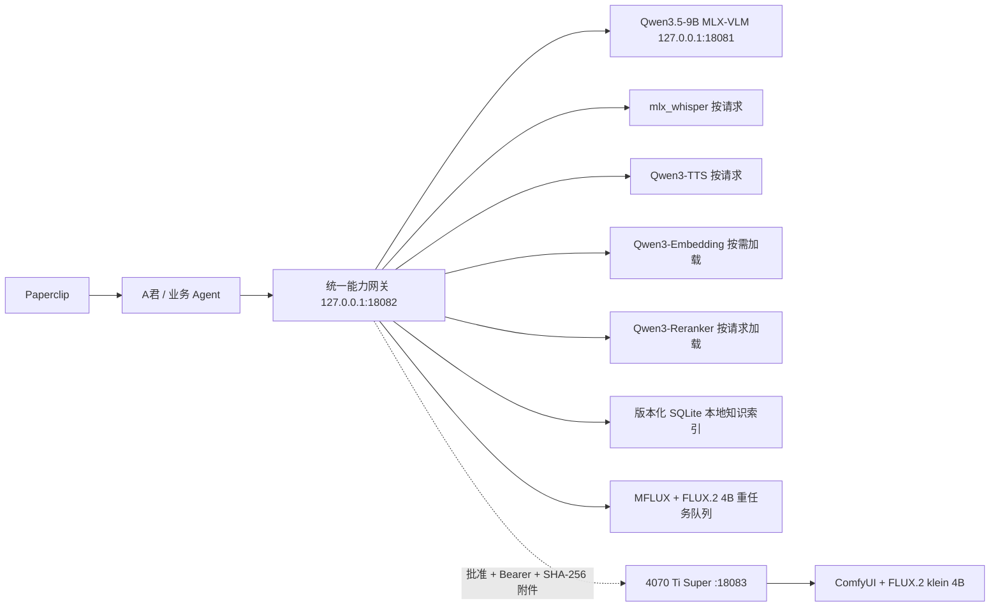

# 本地 AI 能力系统

> 运行控制、按需启动与 4070 节点管理以 [A君 AI 能力控制设计](../design/local-ai-capability-control.md) 为准。A君是全部本地 AI 组件的可见控制入口；Agent 只按能力名调用，不直接操作模型服务。

## 目标与边界

M1 Max 是离线主节点，必须在台式机断线时继续提供文本、视觉/OCR、视频抽帧理解、ASR、TTS、图片生成/编辑、Embedding 和 Rerank。4070 Ti Super 只作为同契约增强节点；未配置或掉线时回到 Mac。视频生成仍是联网且需显式授权的能力，不冒充离线本地能力。

本系统是模型适配层，不是业务控制面：

- Paperclip 继续保存组织级任务、预算、审批和审计真相；
- A君继续保存本机业务任务、一次性审批与产物验证；
- `integrations/local-ai` 只负责模型调用、健康状态、轻量资源互斥和底层进程取消；
- 外发、付费、声音克隆和视频生成继续失败关闭，直到取得对应授权和实现证据。

## 运行拓扑



## 插件安装与运行隔离

本地 AI 的能力 Interface 仍是 `127.0.0.1:18082`，实现由独立的[本地 AI 插件运行时](../adr/0014-local-ai-plugin-runtime-isolation.md)承载。A君 release 只包含调用 Adapter，不包含 `integrations/local-ai`、Python venv、模型或运行数据。

- 插件代码：`~/Library/Application Support/AgentArmy/plugins/local-ai/releases/<hash>`；`current` 原子选择活动版本；
- 运行根：`~/Library/Application Support/AgentArmy/local-ai`；保存 venv、日志、索引、产物、策略与受限配对文件；
- LaunchAgent：安装时按本机用户路径动态生成，不引用项目 checkout；
- 仓库：只保存源码、锁定依赖、固定模型清单、安装器、测试与说明。

代码 release 与运行根分离：升级/回滚插件代码不复制索引、模型或凭据。另一台 Apple Silicon Mac 从仓库运行安装器重建；Windows 4070 仍使用独立 desktop bundle。

`18080` 的 Qwen3.6 35B 是 A君中默认禁用的显式质量候选，不在统一网关的自动回退链里，也不替代 Qwen3.5 的视觉能力；历史 `screen` 常驻方式已移除。

## 能力契约

统一入口为 `POST /v1/invoke`：

```json
{
  "capability": "vision.analyze",
  "request_id": "stable-local-id",
  "input": {
    "prompt": "识别截图中的任务标题",
    "imagePath": "/absolute/path/to/image.png"
  },
  "options": {
    "maxTokens": 256
  }
}
```

响应必须返回 `requestId`、`capability`、`provider`、`elapsedSeconds` 与 `result`。底层失败使用稳定错误码；取消返回 `request_cancelled`，不会标为成功。`GET /v1/capabilities` 分开报告 `declared`、`configured`、`healthy`、`e2eVerified`，没有验收证据时不得提升状态。

| 能力 | Mac 默认实现 | 生命周期 | 资源组 |
| --- | --- | --- | --- |
| `text.generate` | Qwen3.5-9B | 按需启动、空闲释放 | Qwen continuous batching |
| `vision.analyze` | Qwen3.5-9B | 按需启动、空闲释放 | Qwen continuous batching |
| `video.analyze` | FFmpeg 抽帧 + Qwen3.5 | 按请求 | heavy + Qwen |
| `audio.transcribe` | A君模型页可选 StepFun `stepaudio-2.5-asr` 或本机 Whisper large-v3-turbo；本机路线隔离保留 faster-whisper-small 作为人工复核型故障降级 | 按请求 | speech |
| `audio.synthesize` | Qwen3-TTS 0.6B CustomVoice | 按请求 | speech |
| `image.generate` / `image.edit` | MFLUX + FLUX.2 klein 4B | 按请求 | heavy，串行 |
| `embedding.create` | Qwen3-Embedding 0.6B | 按需加载、空闲释放 | retrieval |
| `rerank.score` | Qwen3-Reranker 0.6B | 首次请求加载 | retrieval |
| `knowledge.index` / `knowledge.search` | 版本化 SQLite + Embedding + Rerank | 持久化索引 | retrieval |
| `audio.clone_authorized` | 未安装专用 Base/克隆模型 | 失败关闭 | 需授权 |
| `video.generate` | Agnes/其他网络 Provider | 失败关闭 | 需外发与费用授权 |

## 资源与恢复

- `speech` 串行化 Whisper 与 TTS，防止同一统一内存上重复加载语音模型；
- 小D的现有 `4318` 媒体执行器保持“可靠字幕优先 → 策略选定 ASR”。任务创建时冻结 `stepaudio-2.5-asr` 或本机 MLX 路线；StepFun 已提交后无论确定失败还是结果不明，都不自动重试或跨服务商改投本机，避免重复调用。本机路线仍保持 MLX large-v3-turbo 质量主路；2026-08-07 本机基准证明 CPU `faster-whisper-small` 比 MLX 大模型更慢且更容易出现专有词和繁简混杂，因此渐进快路默认关闭。备用模型只在本机 MLX 确定失败、任务为普通快速任务且时长未超限时应急接管，并强制人工完整听审。
- `heavy` 串行化视频抽帧和 FLUX 任务；图片请求支持稳定 request ID 和进程组取消；
- `retrieval` 保护共享模型实例；Embedding 与 Reranker 首次使用时加载，空闲后释放；
- 子进程超时、非零退出和 OOM 分别保留真实失败，不把部分产物标成成功；
- launchd 只让轻量 18082 保持运行；18081 与 18080 的任务已登记但 `RunAtLoad=false`、`KeepAlive=false`，状态检查不会唤醒模型；
- 本地知识索引固定模型 revision、1024 维、归一化、切块版本、索引版本和 `accessScope`；版本漂移必须新建或显式替换索引，检索结果保留来源片段与元数据；
- 台式机增强节点只允许同一能力契约、私网 IP、显式地址与逐请求 `approved=true`；LAN 监听必须使用至少 32 字符的 Bearer token 和 Mac 单地址 allowlist。正式 Windows 节点为 `192.168.10.110:18083`，Mac 从 0600 配对文件加载令牌且不打印；
- 图片、音频和视频跨机器时不传 Mac 文件路径，而是传 Base64、大小与 SHA-256；台式机只把附件写到本次请求 input 目录，产物只能来自本次 output 目录，Mac 回收后再次校验大小与 SHA-256；
- 4070 的所有重能力默认共用 `gpu-heavy` 单任务队列；节点健康由 Mac 后台周期刷新并缓存，避免远端探测拖慢本地状态接口。节点未配置或掉线不影响 Mac 默认路径，显式指定离线桌面节点则返回真实失败，不伪装已在桌面执行。

## 运维入口

- `npm run local-ai:status`：读取 launchd、端口、队列与四层能力状态；
- `npm run local-ai:smoke`：执行无外发文本和 Embedding 快速回归；
- `npm run smoke:desktop-simulated --workspace=@agent-army/local-ai`：启动真实模拟桌面 HTTP 节点，验收鉴权、附件、产物回传与断线后的 Mac 默认路由；
- `ops/local-ai/install-plugin.sh`：安装/升级外置插件并动态生成三个回环 LaunchAgent；新 Mac 使用 `--bootstrap --download-models`；
- `npm run local-ai:plugin:status`：只读显示插件根、运行根和活动内容哈希；
- `ops/local-ai/desktop/build-bundle.sh`：生成可复制到另一台 Windows/Linux 电脑的 4070 节点包；
- 运行日志和 E2E 状态放在仓库外的 `~/Library/Application Support/AgentArmy/local-ai/`，不得写入聊天原文、凭据或 Cookie。

验收记录见 [本地 AI 能力系统验收](../reviews/local-ai-capability-system/acceptance.md)。
