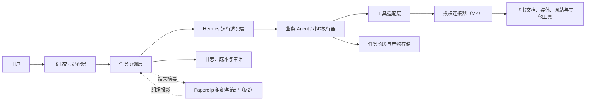
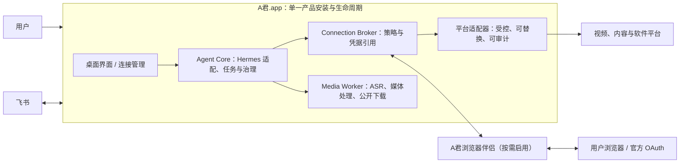

# Agent军团系统架构

| 字段 | 内容 |
| --- | --- |
| 状态 | 生效，M1 分阶段方案已确认，真实外部能力待验证 |
| 负责人 | 技术负责人 / Codex 工作台 |
| 版本 | v1.3 |
| 最后更新 | 2026-07-19 |
| 更新触发 | 核心组件、数据真相、部署边界或平台选型变化 |

## 1. 架构目标

- 让飞书、Paperclip、Hermes 和业务 Agent 各自承担明确职责；
- 让业务逻辑不直接依赖某个平台 SDK；
- 让任务状态、产物、权限和失败能够跨系统追踪；
- 支持从小D一个 Agent 扩展到多个独立岗位，而不提前建设复杂平台。

## 2. 逻辑架构

## 3. 组件职责

### 3.1 飞书交互适配层

负责接收入站事件、识别用户与会话、展示用户级任务状态、请求补充信息或审批、交付文档和附件。它不保存业务执行 checkpoint，也不自行判断任务完整成功。

### 3.2 任务协调层

负责把飞书请求转换为标准任务，生成任务 ID 和幂等键，选择承接 Agent，映射组织级与执行级状态，驱动补偿和交付。它是跨系统协作规则的唯一实现位置。

### 3.3 Paperclip 适配层

从 M2 开始负责组织、岗位、任务归属、预算、审批和跨 Agent 审计信息。它读取执行结果的组织级投影，不建立第二套执行队列，也不反向推进运行时状态。Paperclip 当前未在本机安装，M2 接入前仍需验证真实 API 与扩展能力。

### 3.4 Hermes 运行适配层

负责 Agent Profile、飞书 Gateway 路由、模型、记忆、工具、Kanban 执行任务、调度、取消、恢复、运行历史和 heartbeat 的映射。Hermes 负责运行期能力，不承担最终产物验收；M2 接入 Paperclip 后也不让出细粒度执行真相。

### 3.5 业务 Agent

小D等业务 Agent 只负责自己的领域流程。小D负责素材获取、字幕/音频处理、转录、整理与产物生成，不负责平台治理或飞书事件解析。

### 3.6 工具适配层

封装飞书文档、Lark CLI、媒体下载、模型调用等动作。工具的凭据、重试和速率限制不得泄漏到领域逻辑。

### 3.7 授权连接器（M2）

负责用户自行完成的网站或软件登录授权、受控凭据引用、动作范围检查、续期/撤销和脱敏健康状态。它向业务 Agent 暴露命名连接与受限操作，不暴露 Cookie、密码、token 或完整浏览器会话；连接过期或范围不匹配必须返回可诊断失败，而不能由 Agent 自行绕过。具体平台仍由工具适配器实现。

### 3.8 任务阶段与产物存储

持久化业务阶段、checkpoint、产物元数据和业务幂等信息。执行任务、尝试和运行历史由 Hermes Kanban 保存；第一阶段的业务存储可以沿用本地持久化，但接口必须允许后续替换。

## 4. 数据真相归属

| 数据 | 真相来源 | 说明 |
| --- | --- | --- |
| 岗位、职责、能力、工具白名单和质量标准 | 仓库中的版本化 AgentManifest | M1 与运行配置同步 |
| 部门、组织归属和组织预算 | M2 Paperclip | M1 不建立虚假的组织投影 |
| 用户原始请求和飞书事件信息 | 入站任务记录 | 保留必要字段，避免保存无关私人内容 |
| 执行任务、调度、尝试和运行历史 | Hermes Kanban | 使用标准任务 ID |
| 业务阶段和 checkpoint | 业务任务存储 | Hermes/Paperclip 不覆盖业务安全断点 |
| 组织级任务状态 | M2 Paperclip | 由协调层从执行状态投影，不反向覆盖 |
| 产物元数据与校验结果 | 产物存储 | 文档平台只保存实际内容和权限 |
| 审批决定 | 经验证的 ApprovalContract 存储；M2 Paperclip | 必须关联统一任务 ID |
| 登录态与凭据实际值 | 系统密钥链或受控密钥存储 | 只允许授权连接器访问，不进入 Agent 或任务存储 |
| 连接范围、状态与健康元数据 | M2 授权连接器 | 关联平台、Agent、动作、有效期与审计，不保存原始凭据 |
| 聊天展示状态 | 飞书 | 是投影视图，不是任务真相 |

## 5. M1 主数据流

1. 飞书接收用户消息并生成入站事件标识；
2. 飞书适配层校验来源、用户和必要输入；
3. 协调层使用事件标识去重，创建标准任务 ID 与幂等键；
4. Hermes Kanban 幂等创建执行任务并分配给小D Profile；
5. Hermes 适配层启动小D执行器；
6. 执行器在每个安全阶段持久化 checkpoint 和产物；
7. 协调层把少量关键阶段投影到飞书；
8. 高风险动作按 ApprovalContract 暂停，普通内部交付自动继续；
9. 产物验证器检查存在性、可读性和权限；
10. 飞书完成交付，运行历史记录最终结果；
11. 消息或文档同步失败进入可补偿队列，不修改真实业务结果。

## 6. 状态与一致性

- 所有系统使用同一个标准任务 ID 关联；
- 外部事件和副作用使用幂等键去重；
- 执行状态只允许由运行时状态机推进；
- Hermes Kanban 保存执行任务与运行历史，小D业务存储保存 checkpoint；
- M2 的 Paperclip 状态由协调层投影，不能反向覆盖运行状态或 checkpoint；
- 飞书消息是状态投影，消息发送失败可以补发；
- 关键产物验证失败时不得进入完整成功；
- 不要求跨系统分布式事务，使用持久化状态、可重试同步和补偿保证最终一致。

## 7. 部署边界

第一阶段采用本地或单组织部署：

- M1 不部署 Paperclip；M2 接入后不得直接暴露公网；
- 入站飞书连接只开放必要回调或使用经验证的通道能力；
- 业务执行器、任务存储和凭据位于受控环境；
- 同时运行 3–10 个任务；
- 长任务允许分钟级到小时级执行；
- 关键状态与产物需要备份和恢复办法，但不承诺 7×24 小时高可用。

### 7.1 M2 产品化部署形态

M2 的交付目标是 **A君作为一个本地桌面产品**，而不是由最终用户拼装多套命令行工具。A君.app 启动并监管本地运行时；飞书仍是主要任务入口，浏览器和平台仍在 A君外部。

- 用户日常只安装 A君；当某平台确实需要登录时，才由 A君引导安装或启用其官方浏览器伴侣；
- Worker、媒体工具、ASR 模型与审查通过的平台组件由 A君管理生命周期和脱敏健康状态，不要求用户手工开启后台服务；
- 第三方工具仅是内部实现候选，进入发行包前必须单独完成许可证、供应链、平台条款、版本更新与 macOS 兼容性审查；
- 运行时保留离线本地文件转录路径。外部平台或浏览器伴侣不可用时，A君必须提供本地文件或公开来源的明确替代路径。

## 8. 安全边界

- 每个 Agent 使用独立身份或可审计的最小权限配置；
- 工具白名单默认拒绝未声明能力；
- 凭据只从环境变量或受控密钥存储注入；
- 需要外部登录态的调用必须通过授权连接器；用户不在聊天或任务中提交 Cookie、密码或 token；
- 日志默认脱敏，不记录 token、Cookie、授权链接和不必要的原始私人内容；
- 外发、公开发布、敏感访问、扩权和高成本动作需审批；
- 临时权限到期后默认拒绝。

## 9. 已知失败与恢复

| 失败 | 处理 |
| --- | --- |
| 飞书重复事件 | 使用事件 ID/幂等键返回原任务 |
| M2 Paperclip 投影同步失败 | 记录待补偿，不丢失或反向修改运行时任务 |
| Hermes 启动失败 | 保留 queued/failed 原因，按策略重试 |
| 媒体获取或模型失败 | 从安全 checkpoint 重试，保留原始错误 |
| 飞书文档创建失败 | 产物保留本地，任务进入可恢复交付失败 |
| 权限读取验证失败 | 不标记完整成功，修正权限后重试交付 |
| 服务重启 | 从持久化阶段恢复，不重复已确认副作用 |

## 10. 演进规则

- 第二个真实 Agent 出现前，不引入统一 monorepo 或过度抽象；
- 第二个真实消费者出现后，才把公共任务/产物能力提取到 `packages/`；
- 新平台必须通过适配层并有同一真实任务的对比验证；
- OpenClaw、LangGraph 等候选不因概念匹配自动进入架构；
- 改变数据真相归属、状态模型或核心平台必须新增 ADR。
- 分阶段引入 Paperclip 的决定见 [ADR-0002](../adr/0002-phase-paperclip-after-m1-runtime-closure.md)。
