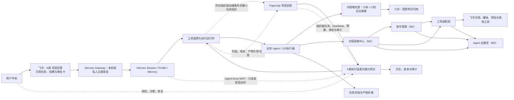
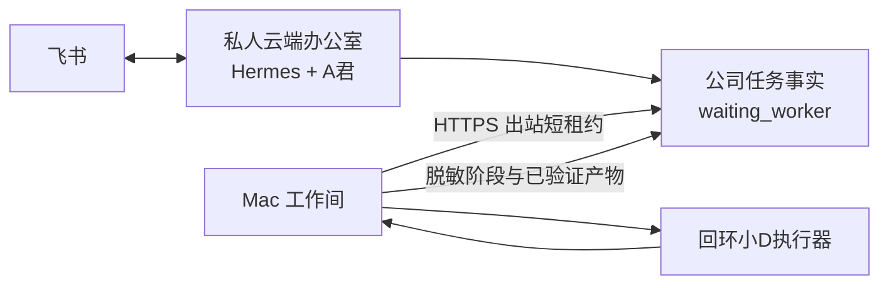

# Agent军团系统架构

| 字段 | 内容 |
| --- | --- |
| 状态 | 生效；M5 并行 v2 已 live apply，发布活动仍关闭 |
| 负责人 | 技术负责人 / Codex 工作台 |
| 版本 | v1.14 |
| 最后更新 | 2026-08-10 |
| 更新触发 | 核心组件、数据真相、部署边界或平台选型变化 |

## 1. 架构目标

- 让飞书、Paperclip、Hermes 和业务 Agent 各自承担明确职责；
- 让业务逻辑不直接依赖某个平台 SDK；
- 让任务状态、产物、权限和失败能够跨系统追踪；
- 支持从小D一个 Agent 扩展到多个独立岗位，而不提前建设复杂平台。
- 让账号连接、内容获取与运维观察成为跨 Agent 的低耦合公共能力，而不是某个 Agent 或具体工具的私有实现。

## 2. 逻辑架构

## 3. 组件职责

### 3.0 模块化单体与共享内核

A君继续采用 Node.js ESM 模块化单体，不因代码规模直接拆成微服务。进程内以任务生命周期、
M5 Campaign 领域、HTTP 路由、Paperclip Client 和持久化接口形成可替换边界；小D、Publisher、
Paperclip 与 Hermes 继续保持既有独立部署边界。`packages/m5-contracts` 保存跨 A君、Pipeline、
内容插件和 Publisher 的稳定 M5 不变量，`packages/paperclip-client` 保存唯一底层 HTTP transport、
Run 身份头、错误规范化和 M5 语义端点。A君 `server.js` 只启动 `startRuntime()`；构造、监听与
后台服务生命周期可以分别测试。爆款雷达也作为 A君内部业务模块运行：复用 `node:sqlite`、同源
HTTP 控制台和进程内小D/军团任务回调，不再保留 Docker/Caddy/跨进程 Token 作为正式链路；
它只保存指标、冻结评分基线和派发引用，不成为组织级任务真相。共享包不得反向依赖 `apps/`
或 `integrations/`。

产品装配根只组合配置、运行状态、本机执行、后台生命周期、活动生命周期、岗位执行、飞书指挥和 Paperclip 系统控制等深层 Module。
具体研究、办公、内容、技术修复、飞书 Channel、Publisher 与 Controller Adapter 留在所属 Module 的
Implementation 内；岗位总装也只组合研究、内容和技术三个能力装配，不再直接依赖几十个实现。
结构门禁限制产品根入口不超过
220 行和 20 个直接 import；各装配 Module 的 Interface 与真实消费者测试共同构成回归 Seam。
这些 Module 的责任上限与受影响测试由 `apps/ajun-runtime/module-policy.json` 单点声明，结构门禁和
聚焦测试选择器共同读取，新增或拆分装配 Module 不再同步修改两套脚本硬编码。
同一策略也约束开放研究来源获取、Paperclip 内容执行上下文、视频脚本生产包和 Campaign Delivery
Evidence：外层保持稳定 Interface，来源资格、可信身份、私有文件协议和 Work Product 漂移规则分别
留在所属深层 Module 的 Implementation 内，不得回流调用方形成影子规则。

任务核心继续通过稳定 `TaskService` Interface 对外，但任务受理、执行协调、审批控制、运行总览和
通知分别由深层 Module 隐藏 Implementation。`TaskOverview` 集中控制台展示、能力健康、用量和账单
解释；`task-approval-coordinator` 是批准、拒绝、Paperclip 已决事实恢复与小D控制的唯一实现。
任务注意力展示、任务恢复、任务记录详情视图和前端刷新调度已落成独立 Module：服务端只输出
版本化安全关注契约与按访问者分级的任务投影；恢复端只接受登记动作、短期主人 nonce、幂等键和
乐观并发版本，并把 Paperclip 恢复追加到原 Issue 子任务链；前端详情区块和 15 秒刷新调度保持
可独立测试。上述仍是候选源码 Implementation，尚未冻结或切换到当前 `4321` live。
任务类型、默认/固定岗位、入口意图、展示名、开放委派和安全批准继承统一由
`TaskDefinitionRegistry` 提供；状态标签、终态/阻塞/通知停止语义、Paperclip 映射与生命周期事件策略
统一由 `TaskStatusPolicy` 提供。MCP、HTTP 与 Client 共用任务输入及 Adapter 投影契约，消费者不得维护
影子映射。架构门禁限制 `TaskService` 不超过 250 行，拒绝外层重新声明已委托方法，并校验岗位 Manifest
中的任务类型均已登记；TaskService 接缝测试按责任拆分且单文件不得超过 1800 行。

#### 业务工作流与能力执行栈

新增业务执行统一按 `Model → Agent Runtime → Skills / Business Workflow → Policy / Permission → MCP / CapabilityAdapter Gateway → API / SaaS / DB / Browser` 组织，Audit、Trace 和 Evaluation 横切每层。

Business Workflow 是业务主对象，跨岗位子任务共享 `workflowId`，每个步骤拥有稳定 `stepId`。Policy 结合 Manifest、数据等级、副作用、凭据和预算决定自动允许、人工本机授权、Paperclip 批准或拒绝；Model 不能批准自己的能力请求。CapabilityAdapter 是 Workflow 与具体 Provider Implementation 的 Seam；本机无副作用能力允许一次自动恢复和一次重试，成功后生成只保存输入/输出哈希的 ExecutionReceipt。Workflow Evaluation 同时核验任务终态、关键产物门禁和人工验收，不再以聊天回复或单一 status 推断业务完成。

新的 Workflow、Policy、Evaluation 和 Interface 使用 TypeScript；旧 JavaScript 执行器经 Adapter 渐进接入。架构门禁拒绝 Workflow 核心回退成 JavaScript、直接依赖 Paperclip/Hermes/飞书/本机 AI Implementation、直接发网络请求或启动进程。

任务状态由 `task-lifecycle` 统一验证，JSON 与 SQLite Store 使用同一迁移规则。SQLite 使用 Node
内置 `node:sqlite`、WAL 和版本化 schema；A君 live 已显式设置
`AGENT_ARMY_TASK_STORE=sqlite`，最终 JSON 快照 `587/25/16/6/5` 的数量与关键 ID 校验通过，原
JSON、校验备份和 plist 回滚备份保留。运行包与技术修复源码互不包含：当前不可变 release
`389141e4…` 与独立干净源码 worktree 均绑定提交 `26a4a461…`。根 npm Workspace 和
`test:affected` 根据包与共享契约依赖选择回归范围，全量测试仍保留为发布门禁。

### 3.1 飞书交互适配层

飞书中的“ A君·军团总管”是主要日常总管入口。A君、小D、小R、小办和运维官保持独立 Hermes Gateway 常驻；创建官、审核官、架构师和技术专家保留独立 Profile、岗位边界和 Paperclip `hermes_local` 按需执行能力，但不再拥有常驻 Gateway 或独立飞书入口。任务接收、路由和多人总任务由 A君承担；GitHub 公开研究由小R承担。飞书适配层不保存业务执行 checkpoint，也不自行判断任务完整成功。仓库 Profile/配置器、实际 `~/.hermes` 配置、Paperclip Adapter 和 A君不可变 release 必须分别对账；当前 11 个正式岗位已切到 `deepseek/deepseek-v4-flash` 且回退链为空，5 个常驻 Gateway 和 A君 fresh runtime 已重启。配置对账不替代真实 DeepSeek 调用证据。

### 3.2 Paperclip 军团总控

Paperclip 是军团唯一的组织级控制面和任务总控：维护公司目标、组织树、岗位与汇报关系、组织级任务及其依赖、heartbeat 唤醒、预算、组织级审批、暂停/恢复和审计。它可通过适配器管理 Hermes、Codex、Claude Code、Cursor、OpenClaw、脚本或 HTTP 服务等不同运行时。它不替代业务 Agent 对产物质量的验证，也不接管普通一次性审批。

### 3.3 A君本机能力网关与执行适配层

负责托管本机组件、连接授权、内容获取、执行适配、业务产物诊断和恢复。它通过稳定契约把 ASR、下载器、浏览器伴侣与平台适配器隔离在业务 Agent 之外；接收 Paperclip heartbeat 时向受控本机执行器传递最小任务上下文，并将阶段、成本、产物引用与失败分类回报 Paperclip。HTTP 岗位若需要调用受保护的工具入口，身份必须来自当前 Paperclip Run：版本锁定的 `forwardRunJwt` 兼容层只允许向 loopback 转发短期 Run JWT，禁止配置 header 覆盖和重定向；原始 live adapter 未启用该能力时必须失败关闭，不能降级为长期 API Key。飞书是日常派活与交付入口；A君界面只提供授权、组件健康、恢复和脱敏诊断，不维护第二套组织、排程、预算、审批或审计真相。

### 3.4 Paperclip 任务路由边界

飞书军团总管先确定任务类型、风险和治理条件。低风险、单 Agent、输入完整且可立即完成的请求直达运行时；本次范围明确的一次性审批由飞书卡片与 A君 `ApprovalContract` 闭环，均不创建 Paperclip 任务。只有新 Agent、扩权/账号连接、公开发布、付费/预算、跨 Agent 协作、长任务调度、暂停/终止或跨岗位审计才创建或关联 Paperclip 组织级任务。关联键是飞书事件幂等键；投影只含任务 ID、事件引用、负责人、状态摘要、预算/审批引用、产物引用和脱敏失败分类。原始聊天正文、媒体、字幕和业务 checkpoint 留在飞书或业务存储。

Paperclip 不可访问时，前两类日常请求不被额外阻塞；组织级请求则停在 `waiting_governance` 并通过飞书提示等待恢复。不得为了继续执行而把 `paperclip` 审批改写为 A君 `local` 审批，也不得以飞书卡片点击代替 Paperclip 的审批记录。恢复后由 A君 重新读取决定、范围、有效期与幂等键，再允许执行适配器继续。

### 3.5 Hermes 与其他执行运行时适配层

Hermes 或其他执行运行时负责其 Agent Profile、模型、短期会话、压缩摘要、长期用户偏好、工具选择、单次运行、取消、恢复和运行历史。Hermes 通过 loopback `stdio` Agent Army MCP 读取 A君能力与任务真相；MCP 不保存凭据、会话或第二套队列。Paperclip 发起或管理 heartbeat；运行时不得自行形成脱离 Paperclip 的长期军团任务队列。业务 checkpoint 和产物仍属于业务 Agent/A君的持久化边界。

老板一次提出多项清晰交付物时，A君可通过 `mission_create` 创建一个父任务和最多十一个受限子任务。每项以唯一 `key` 标识并可通过 `depends_on` 构成无环依赖图；没有依赖且仍有执行槽位的员工同时开始，活动并发不超过四项。汇总类员工必须等所依赖的来源任务进入终态后再工作；父任务只按实际子任务状态和已验证产物形成统一汇报。每名员工使用独立 Hermes Profile，并由 Manifest 驱动岗位 Prompt、Skill、飞书与 Paperclip Toolset；MCP 环境作用域限制可见员工、可创建任务类型和是否允许再次组建任务，不能只靠 Prompt 约束。Paperclip 通过官方 `hermes_local` Adapter 唤醒同一员工 Profile，Profile 只读取一次当前指派并把结果回写同一 run。任务、审批与产物真相仍在 A君/Paperclip 和业务存储，Profile 只保存各自会话、记忆与运行配置。

M4 的 11 个开放任务入口继续保留，但 A君只做无状态的岗位委托映射：开放任务直接复用岗位已有专有执行器，能力请求只和岗位 Manifest 白名单比对，未登记能力保持闭锁。小R开放研究根据真实 Observation 在公开网页、动态网页、PDF 与 GitHub 只读适配器间换路；安全重试最多 2 次，耗尽后请求 Paperclip 重规划，预算不足或三次重规划耗尽时失败关闭，只有当前 Run 的健康产物才能写为 Work Product。恢复 Work Product 时同时校验外层和内嵌 Observation 的 Issue/Run 与当前 assignment 一致，拒绝任务自报及跨 Issue/Run 注入。A君不生成 `autonomous_work_plan`、任务级 CapabilityGrant、预算或 checkpoint，也不写 `capability-grants.json`；组织计划、Issue、预算、审批和恢复属于 Paperclip，Hermes 保存执行会话与运行检查点。历史自主计划模块仅供迁移测试，不得被生产 `server.js` 或 `TaskService` 引用。11 个正式岗位主推理模型按 ADR-0011 统一为 `deepseek/deepseek-v4-flash`，不配置 StepFun 文本回退。2026-07-31 的 StepFun 11/11 文本探针和语义门禁继续作为历史模型证据保留，不证明当前 DeepSeek 主传输；本次切换只完成配置、Gateway、Paperclip Adapter 与 fresh A君 runtime 对账，未执行付费模型探针。微信私密只读检索岗位继续使用本机模型，不计入这 11 岗；Profile 元数据不保存 Key。

#### M5 内容自治与并行 v2 边界

M5 不新增第二套活动状态库。Paperclip Project、父/子 Case、Routine、blocker、Issue、
Work Product、预算和审批是活动执行真相；Hermes Profile 执行岗位任务；内容插件只提供
StepFun、媒体、Remotion、固定产物与发布前门禁；无模型 Publisher Gateway 独占真实发布。

源码候选与 live 必须分开报告。当前源码候选是 16 阶段、18 个 Routine（17 个阶段/分支
Routine + 1 个 daily Routine）和 6 个确定性控制器：`daily`、`parallel`、`publisher`、
`metrics`、`retrospective`、`learning`；live 仍为 15 阶段、17 个有效 Routine 和 5 个控制器。
研究、证据、画面分析和生图各自落到 Paperclip 子 Case，配音等待可信脚本，`parallel`
控制器只在四项 Work Product 全部存在、可读、非空且 blocker 清零后推进渲染。最大并发
仍为 4；调用模型的岗位不能自行修改 Case 依赖、预算、审批或汇聚结论。live 草案仍为
`0/14`、Cron off，源码新增结构尚未 apply。

灰度日采用完整双变体契约：`baseline` 独立驱动 master 与小红书版本，`gray_douyin`
独立驱动目标抖音版本。两个变体分别绑定脚本、TTS、模板版本、渲染和机器审核血缘；
`gray_douyin` 还必须精确绑定日期父 Case、预约日期和抖音平台 Case。缺少完整双变体、
脚本或音频哈希重复、跨平台串线及绑定漂移均失败关闭。

当前根自动化为 `1557/1557`，其中 A君 `1092/1092`、Pipeline `67/67`、内容插件
`97/97`、Publisher `203/203`；Node 24.18.1 的完整 `test`/`check` 也通过。A君 `4321` 已加载
本轮不可变 release；live 内容插件已为 `0.4.9`，Paperclip API、插件健康检查与 worker 路径一致。版本收敛没有触发真实 Provider 调用或平台发布。
Paperclip Run-JWT 与一次性恢复 Approval 版本锁定兼容补丁合并 `15/15`。controller
cutover 工具 `15/15`，其快照读写 TOCTOU 已使用同 fd、`O_NOFOLLOW`、dev/ino 复验、
原子 no-replace 发布和固定原目录身份的清理器修复；post-link 父目录替换后两侧目录零残留、
0 Paperclip PATCH，清理不完整时标记 `recoveryRequired`。A君 current-run 恢复 access 已实际 wire 进 server composition
和 metrics 请求级 Run 凭据作用域，provider composition `43/43`、相关 server/controller
`84/84`。当前 `4321` 已加载该 binding，但原始 live Paperclip adapter 仍未 apply 兼容补丁；
因此 live HTTP 控制器仍不能凭上述本地证据宣称执行闭环。一次性恢复必须绑定
company/agent/run/issue/link 和 canonical scope，过期、撤销与 consume 原子互斥，同一
run/agent/scope 只允许 exact replay。运行时切换恢复另分为 `exact_previous` 与
`verified_degraded_fallback`：前者要求内置可信 OS/launchd/不可变 release 联合证明和兼容
状态快照；后者只能本地恢复、隔离外部状态，并仍要求共享状态静默快照与恢复演练。当前没有
可信的内置状态采集器，调用方注入证明不被接受，所以两条路线均不签发启动配置，也不能由
部分外部状态推断“可安全恢复”。Publisher Gateway 作为独立服务监听 `4390`，默认
`disabled`；production 代码已完成接线，但 live 尚未注入 production 依赖，也不存在真实
selector bundle、命名 Profile lease 或平台写授权，因此当前不具备真实外写条件。未批准
活动、缺少 Secret/岗位绑定、验证码、风控、未知页面、预算超限或重复内容仍在任何真实
外写前失败关闭。

本地 Fake E2E 以真实无模型协调器覆盖 15 阶段、五分支 `[4,1]` 并发波次、前置依赖、
一次退回、一次安全重试、检查点恢复、预算硬停、幂等发布、2h/24h/72h 模拟指标和复盘；
结果为 `5/5`、`externalEffects=false`、`paidCalls=0`。7 天 Publisher 验收使用 14 支
真实本地 MP4 生成 14 个 fake PublishReceipt 和 42 个模拟 MetricSnapshot，并在 44 次
Runtime 重建后重放同一 72h 快照；`realPlatformTouched=false`、`externalPublished=false`、
`realPlatformCalls=0`、`totalCostUsd=0`。这只证明本地 Fake 契约与恢复，不是平台发布或
真实 72 小时指标。

候选源码中的通用 Hermes one-shot 已移除 `--ignore-rules`，普通调用固定为 `clarify`，
只有无 Provider 的受控故事板分支允许 `vision`。正式画面分析只能由当前 Paperclip Run
的单用途回调触发，绑定固定 action、相对 PNG、帧哈希、时间点、confirmed receipt 和同一
Project；新产物和已有视觉 Work Product 重放都必须通过同一校验，漂移时阻塞且不覆盖。
内容插件固定视觉模型 `step-1o-turbo-vision`、生图/改图模型 `step-image-edit-2` 与 TTS
模型 `stepaudio-2.5-tts`，Provider action、费用事件和产物血缘必须记录并反查同一模型身份。
渲染必须实际消费可信 `GeneratedImagePackage`，机器审核必须从同 Project 插件状态反查
图片、视觉、TTS 三条 confirmed action/cost。上述安全边界只在候选源码和本地 Fake 测试
通过并已随 live 插件 `0.4.9` 加载；这只证明运行版本与门禁代码已对账，仍没有真实 M5 Campaign StepFun 视觉调用。
`0.4.9` 已冻结为候选包
`work/m5-content-autonomy/plugin-packages/content-autonomy-bundle-0.4.9-b64760f6c00e2031d5a5ae51fac4a76e26183698e1bb9bf536e407fd27592c0d/`：
`payloadHash=b64760f6c00e2031d5a5ae51fac4a76e26183698e1bb9bf536e407fd27592c0d`、
`entryCount=19986`、`manifestSha256=dabf16ac255eec3348e5800239f907793db1c1e507d1aa2820cd57fb71ec8dd7`，
独立全目录哈希为 `82f75845b927c8fa817e45e8e4d588338c7131677f2681c7297dba987db0c8bd`。
为搬移候选包，仅 bundle 根目录曾由 `0555` 短暂调整为 `0755`，内部条目未改；完成后根目录
恢复 `0555`、manifest 保持 `0444`，独立逐项复算与安全审计放行。该包现已安装到 live 并处于 `ready/healthy`。

内容插件上游原生 lineage 的历史本地产物仍保留：`native-artifact-smoke` 以 Provider 0
完成 1/1 份 lineage 和 3/3 支平台媒体，均为 1080×1920、45 秒、H.264/AAC、黑帧 0、
-15.1 LUFS。旧 StepFun Provider 账本保留 35 个 action-linked 费用记录、合计 42 美分和
`lifetimeProviderCalls=43`；本轮没有新的 Provider 请求、调用或费用。历史
`m5v2-lineage-v2` 仍以 0 Provider 调用保留 7/7 份 lineage 和 21/21 支媒体复核，响度
-15.2 至 -14.9 LUFS。另有 3 主题、9 视频本地 dry-run `12/12`。这些血缘与媒体账本均为
`externalPublished=false`。

CuaDriver runner 现在保留真实 `browser_consent_required`，不再误报为
`prepared_browser_pid_missing`。完整本地假页 Computer Use 验收仍需要当次生成、五分钟
有效、单次使用的 browser approval token；Token 不得打印、落盘或复用。真实 selector、
Profile lease、账号登录与平台写入仍未验收。

A君的运行包和技术修复源码现在是两种不同身份：不可变 release 只读运行；技术修复只接受
显式外置、clean、可写且 Git 身份可验证的源码根。修理副本绑定 task、Git common-dir、HEAD
和精确文件范围；越界路径、错误 Worktree、源码漂移以及部分 promotion 失败必须拒绝或回滚。
即使外置源码修复成功，也只得到 `candidate_promoted` 并进入
`repair_candidate_awaiting_release`，必须再冻结并验证新 release，不能把候选源码当作
当前运行版本。源码根/修理副本/候选发版聚焦回归为 `139/139`。

本机持久任务状态与飞书 completion watcher 采用唯一临时文件、`wx`/0600、原子 rename 和
rename 后 chmod；既有 0644 状态会收敛到 0600，失败不能破坏旧文件或无关临时文件。对应
`task-store` 与 `official-feishu-completion-watcher` 回归为 `15/15`；本轮没有直接修改
真实数据文件权限。

r3 已从 source commit `ae1e857dbeba0c12febd5575e10ccd0990d20bd0` 冻结为未激活候选，
本轮候选范围 41 个文件；`releaseHash=fed585fae5bd564fa42ceae086fa299d04aa922229a959046806770f346d4517`、
`payloadHash=18728449689cd7d6d272d077cb9ec3ad64e52b4762fa59580c0934a89448d6a9`、
`manifestSha256=c95dc4d421e6adee28d0f4011c27adc4645a973485295bc573fa0f60428046ae`，
main/recovery smoke 均通过。r2 只保留为历史候选。当前没有修改 live/plist、没有重启、
发布或外发；exact/degraded plan 均为 `blocked`，`args`、`cwd`、`env` 为 `null`。

### 3.5 业务 Agent

小D等业务 Agent 只负责自己的领域流程。小D向内容获取中心请求素材，再负责字幕/音频处理、转录、整理与产物生成；它不直接保存登录态、不直接选择底层工具，也不负责平台治理或飞书事件解析。

M3 内容增长链路在业务产物层新增两个后台按需岗位，不新增独立飞书 Gateway：小拆只读取当前任务引用的转录、确认和指标产物，生成拆解或复盘；小创只读取确认稿和正式拆解，生成待审平台草稿。A君仍是唯一入口和交付路由，Paperclip/Hermes 负责按需唤醒。默认由小D质量门禁自动生成版本化确认稿；异常或用户明确要求时转真人完整听审。自动确认明确记录 `completeListen=false`，不能冒充人工；未确认机器稿只能驱动降级的初步拆解，不能进入正式创作。

小办通过 A君托管的 `KnowledgeArchiveWriter` 写知识笔记。写入器调用 Auto-work `content_system_runtime.py` 解析统一内容库根目录，并将目标固定到 `Agent军团/` 逻辑目录；Agent 不接收 Vault 绝对路径，也不具备全库读取和私人笔记搜索能力。

### 3.6 工具适配层

封装飞书文档、Lark CLI、媒体下载、模型调用等动作。工具的凭据、重试和速率限制不得泄漏到领域逻辑。

### 3.7 账号管家（M2）

负责用户自行完成的网站或软件登录授权、受控凭据引用、动作范围检查、续期/撤销和脱敏健康状态。登录输入可以来自受控浏览器、OAuth、CookieBridge 或其他本机导入适配器；输出给执行器的是一次受限的连接使用权，不是原始 Cookie、密码、token 或完整浏览器会话。连接过期或范围不匹配必须返回可诊断失败，而不能由 Agent 自行绕过。

### 3.8 内容获取中心（M2）

负责接收平台无关的“读取此来源并提供这些内容能力”请求，识别平台、检查连接、选择适配器并把结果标准化为 ContentPackage。B站转录先由受控原生字幕适配器尝试可用字幕，并用字幕条数、文本量和尾部覆盖率拒绝片头推广等伪字幕；没有合格字幕时继续走 MediaCrawlerPro 独立音轨或通用媒体通道，最后由小D本机 ASR。视觉分析仍走同一中心，但使用受控运行用途单独取得含画面的视频，不能把转录用独立音轨当视觉素材；非B站来源不会调用B站字幕适配器，本地上传直接复用任务文件。其他固定支持平台优先走 MediaCrawlerPro 深度适配器，可提供评论等平台能力；不支持或深度通道不可用时按能力规则走通用内容适配器。它向上层说明实际使用通道与实际提供的能力范围，但不将通用通道结果误标为失败或“内容不完整”。

### 3.9 Agent 运维官（M2）

负责从账号管家、内容获取中心、工具适配器和任务协调层读取脱敏健康事件，发现连接失效、适配器故障、连续失败和通道切换。第一阶段只执行诊断、通知、低风险重试和 A君自管组件恢复；它不能读取凭据、导出受限内容、替用户登录或绕过验证码、二次验证、付费和平台访问控制。

### 3.10 任务阶段与产物存储

持久化业务阶段、checkpoint、产物元数据和业务幂等信息。单次执行尝试和运行历史由接入的执行运行时保存，组织级任务和 heartbeat 由 Paperclip 保存；第一阶段的业务存储可以沿用本地持久化，但接口必须允许后续替换。

### 3.11 低耦合扩张口

新增本机能力时必须通过以下稳定边界，而不是让业务 Agent、Hermes 或 Paperclip 直接依赖具体组件：`CapabilityProvider` 声明能力、版本、健康与生命周期；`ConnectionBroker` 判断连接和授权；`ContentAcquisitionCenter` 返回平台无关内容包；`ExecutionBridge` 接收受限执行请求并回报结果；`RecoveryDiagnostics` 提供脱敏事件与可执行恢复动作。替换或新增下载器、ASR、浏览器伴侣、平台适配器时，只新增或替换对应 Provider，不修改业务 Agent 的领域流程。

### 3.12 第一批 Agent 创建与上线链路

飞书中的“创建官”接收自然语言岗位需求，生成 `AgentProposalContract` 草案；架构师检查复用与边界，审核官检查权限、预算和外部动作。Paperclip 保存招聘审核和 Agent 身份；批准后 A君 准备本机受限能力，Hermes 建立隔离测试 Profile，并以一条白名单验收任务验证真实产物。仅验收通过的草案才能标为 `active` 并被飞书路由。创建官、架构师、审核官、运维官和协调官都属于受限治理角色：它们默认不读取凭据、不自动扩权、不直接发布或外发；运维官只可调用 A君登记的低风险恢复能力。

创建官可以把“已登记但高风险”的本机能力写入草案，用于提前评审复用方向、最小数据范围和审批条件；尚无受控适配器时必须标为 `needs_capability`，不得直接创建测试实例。微信本机 Vault 已增加只读受控适配器后，只允许先用合成聊天验证临时授权、单会话、固定时间范围和原文不落盘，因此可标为 `ready` 进入一次技术验收；这个状态不授权任何真实聊天读取。真实请求首次仍必须由负责人指定单一会话和固定时间范围；批准后只在同一飞书会话、岗位和范围内签发 30 分钟、最多 10 次且可撤销的临时授权。改变范围、过期或用尽必须重新确认；私密内容只允许进入回环 Qwen3.5-9B OpenAI-compatible 服务，没有云端或台式机 fallback，且禁止把密钥、完整数据库、聊天原文、发送者或微信内部 ID 写入 Paperclip、任务描述、日志和项目工作区。Skill 存在、适配器可用、合成技术验收通过、真实私密数据验收和正式上岗是不同状态，不得互相替代。

## 4. 数据真相归属

| 数据 | 真相来源 | 说明 |
| --- | --- | --- |
| 岗位、职责、能力、工具白名单和质量标准 | 仓库中的版本化 AgentManifest | M1 与运行配置同步 |
| 公司目标、部门、组织归属、岗位、组织级任务、heartbeat、预算、组织级审批和审计 | M2 Paperclip | 军团唯一组织级总控；A君不建立重复真相 |
| 一次性任务审批、范围、有效期和决定 | A君 `ApprovalContract` | 飞书卡片是决策界面；不满足组织级条件时不投影 Paperclip |
| 用户原始请求和飞书事件信息 | 入站任务记录 | 保留必要字段，避免保存无关私人内容 |
| 单次执行尝试、运行时会话和运行历史 | 对应执行运行时 | 通过 Paperclip 任务 ID 关联；不形成第二个长期队列 |
| 业务阶段、checkpoint、产物元数据与质量结果 | 业务 Agent / A君业务存储 | 回报给 Paperclip，但不得以 Paperclip 状态覆盖业务安全断点 |
| 登录态与凭据实际值 | 系统密钥链或受控密钥存储 | 只允许授权连接器访问，不进入 Agent 或任务存储 |
| 连接范围、状态与健康元数据 | M2 账号管家 | 关联平台、Agent、动作、有效期与审计，不保存原始凭据 |
| 适配器能力、覆盖平台与路由优先级 | M2 内容获取中心的适配器注册表 | 业务 Agent 不能在任务中修改或指定底层工具 |
| 内容请求、统一内容包和能力说明 | M2 内容获取中心与业务 checkpoint | 记录来源与实际能力，不保存原始凭据或会话 |
| 机器转录、质量报告、自动/人工确认声明和确认稿 | 小D业务存储 | 版本、确认方式和校验值不可静默覆盖；正式下游只认确认稿 |
| 拆解、平台草稿和表现复盘 | A君业务产物存储 | 以来源产物引用连接版本；草稿不代表已发布 |
| M5 活动阶段、并行分支、阻塞、预算、审批与恢复 | Paperclip Project / Case / Routine / Issue / Work Product | A君只聚合显示，不保存第二份活动状态；v2 已 live apply 为 15 阶段、17 Routine、5 控制器的结构。A君 live 已加载恢复 provider，但 Paperclip 侧 Run-JWT 与一次性恢复 Approval 兼容补丁未 apply，结构对账不等于执行闭环 |
| M5 内容工具、素材/成片哈希、固定产物清单与插件费用事件 | Paperclip 内容插件与受控内容工作区 | live 插件为 `0.4.9`，`0.4.6` 为不可变回滚包；Secret 值不进入产物或日志 |
| M5 发布凭证与指标快照 | Publisher Gateway 插件状态及 Paperclip Work Product | 独立 `4390` 服务默认 `disabled`；production 代码已接线但 live 未注入，且无真实 selector、Profile lease 或写授权 |
| Agent军团知识总结笔记 | Auto-work 统一内容库 `Agent军团/` | 小办只有受限写入，不拥有 Vault 全盘读取 |
| 运维健康事件和安全恢复记录 | M2 Agent 运维官 / 治理控制面 | 只记录脱敏事件、动作和结果 |
| 聊天展示状态 | 飞书 | 是投影视图，不是任务真相 |

## 5. M1 主数据流

1. 飞书接收用户消息并生成入站事件标识；
2. 飞书适配层校验来源、用户和必要输入；
3. 协调层使用事件标识去重，创建标准任务 ID 与幂等键；
4. Hermes Kanban 幂等创建执行任务并分配给小D Profile；
5. Hermes 适配层启动小D执行器；
6. 执行器在每个安全阶段持久化 checkpoint 和产物；
7. 协调层把少量关键阶段投影到飞书；
8. 高风险动作按 ApprovalContract 暂停，普通内部交付自动继续；
9. 产物验证器检查存在性、可读性和权限；
10. 飞书完成交付，运行历史记录最终结果；
11. 消息或文档同步失败进入可补偿队列，不修改真实业务结果。

## 6. 状态与一致性

- 所有系统使用同一个标准任务 ID 关联；
- 外部事件和副作用使用幂等键去重；
- 执行状态只允许由运行时状态机推进；
- Paperclip 保存组织级任务、heartbeat、预算、组织级审批和审计；A君保存一次性审批；执行运行时保存单次运行历史，小D业务存储保存 checkpoint；
- 业务阶段、产物和失败由协调层回报给 Paperclip；Paperclip 不覆盖业务安全断点，也不得把部分成功转成完整成功；
- 飞书消息是状态投影，消息发送失败可以补发；
- 关键产物验证失败时不得进入完整成功；
- 不要求跨系统分布式事务，使用持久化状态、可重试同步和补偿保证最终一致。

## 7. 部署边界

第一阶段采用本地或单组织部署：

- M1 不部署 Paperclip；M2 接入后不得直接暴露公网；
- 入站飞书连接只开放必要回调或使用经验证的通道能力；
- 业务执行器、任务存储和凭据位于受控环境；
- 同时运行 3–10 个任务；
- 长任务允许分钟级到小时级执行；
- 关键状态与产物需要备份和恢复办法，但不承诺 7×24 小时高可用。

### 7.1 M2 产品化部署形态

M2 的交付目标是 **A君作为一个本地桌面产品**，而不是由最终用户拼装多套命令行工具。A君.app 启动并监管本地运行时；飞书仍是主要任务入口，浏览器和平台仍在 A君外部。

- 用户日常只安装 A君；当某平台确实需要登录时，才由 A君引导安装或启用其官方浏览器伴侣；
- 当前 A君运行台通过本机回环适配器读取小D账号管家的脱敏连接状态，并只提供撤销动作；不复制连接数据库、不接收原始 Cookie/Token，也不把连接健康冒充业务任务成功；
- Worker、媒体工具、ASR 模型与审查通过的平台组件由 A君管理生命周期和脱敏健康状态，不要求用户手工开启后台服务；
- 第三方工具仅是内部实现候选，进入发行包前必须单独完成许可证、供应链、平台条款、版本更新与 macOS 兼容性审查；
- 运行时保留离线本地文件转录路径。外部平台或浏览器伴侣不可用时，A君必须提供本地文件或公开来源的明确替代路径。

### 7.2 私人云端办公室与 Mac 工作间

`ops/hybrid-online/` 提供可部署的双端边界：私人云端只运行 Hermes Gateway、A君任务事实、公开研究和轻量工作；Mac 工作间只通过出站 HTTPS 短轮询领取本机任务。本机文件、私人登录态和音视频执行器不上传云端。

- 云端 A君 只绑定回环地址，并通过 Google IAP SSH 回环映射访问；禁止公开暴露 A君或 Paperclip 端口；
- Worker Token 与飞书/模型凭据分离，租约过期后可被在线设备接管，旧租约不得覆盖新结果；
- Mac 离线时云端继续收消息和执行公开轻量工作；依赖 Mac 的任务停在 `waiting_worker`；
- Mac 重新上线后 launchd Worker 自动领取，使用云端任务 ID 幂等创建本机小D工作；
- 当前仓库已完成隔离云端运行验收，但用户已选择先本地 Mac 运行；在真实云主机、IAP 隧道和 Mac 关机飞书消息验证前，不得声称 7×24 已上线。

### 7.3 本地 AI 能力适配层

M1 Max 通过回环统一网关提供文本、视觉、视频抽帧理解、ASR、TTS、图片生成/编辑和检索模型能力；4070 Ti Super 只作为可拔插的同契约增强节点。模型适配层管理健康、底层资源互斥、超时和进程取消，不创建业务任务或第二套控制面。完整端口、能力、生命周期与降级规则见 [本地 AI 能力系统](./local-ai-capability-system.md)。

## 8. 安全边界

- 每个 Agent 使用独立身份或可审计的最小权限配置；
- 工具白名单默认拒绝未声明能力；
- 凭据只从环境变量或受控密钥存储注入；
- 需要外部登录态的调用必须通过账号管家；用户不在聊天或任务中提交 Cookie、密码或 token；
- 业务 Agent 只调用内容获取中心；不得直接调用 MediaCrawlerPro、`yt-dlp`、CookieBridge 或浏览器会话；
- 日志默认脱敏，不记录 token、Cookie、授权链接和不必要的原始私人内容；
- 外发、公开发布、敏感访问、扩权和高成本动作需审批；
- 临时权限到期后默认拒绝。

## 9. 已知失败与恢复

| 失败 | 处理 |
| --- | --- |
| 飞书重复事件 | 使用事件 ID/幂等键返回原任务 |
| M2 Paperclip 任务回报失败 | 记录待补偿；不重复领取任务、不丢失业务 checkpoint，也不把未回报的结果标成完成 |
| Hermes 启动失败 | 保留 queued/failed 原因，按策略重试 |
| 媒体获取或模型失败 | 从安全 checkpoint 重试，保留原始错误 |
| 深度内容适配器不可用 | 内容获取中心按已声明能力切换到通用通道，并记录脱敏运维事件 |
| 登录失效或范围不匹配 | 账号管家拒绝使用并请求用户重新授权；不向 Agent 暴露凭据 |
| 平台要求验证码、二次验证或付费权限 | 任务等待用户处理或安全结束；运维官只通知和诊断 |
| 飞书文档创建失败 | 产物保留本地，任务进入可恢复交付失败 |
| 权限读取验证失败 | 不标记完整成功，修正权限后重试交付 |
| 服务重启 | 从持久化阶段恢复，不重复已确认副作用 |

## 10. 演进规则

- 第二个真实 Agent 出现前，不引入统一 monorepo 或过度抽象；
- 第二个真实消费者出现后，才把公共任务/产物能力提取到 `packages/`；
- 新平台必须通过适配层并有同一真实任务的对比验证；
- OpenClaw、LangGraph 等候选不因概念匹配自动进入架构；
- 改变数据真相归属、状态模型或核心平台必须新增 ADR。
- 分阶段引入 Paperclip 的决定见 [ADR-0002](../adr/0002-phase-paperclip-after-m1-runtime-closure.md)。
