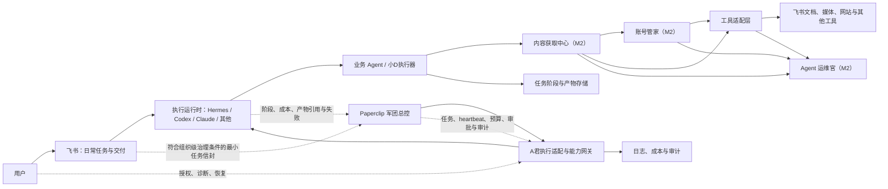
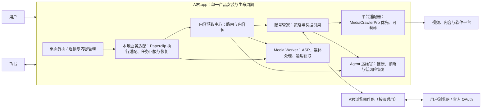

# Agent军团系统架构

| 字段 | 内容 |
| --- | --- |
| 状态 | 生效，M1 分阶段方案已确认，真实外部能力待验证 |
| 负责人 | 技术负责人 / Codex 工作台 |
| 版本 | v1.5 |
| 最后更新 | 2026-07-20 |
| 更新触发 | 核心组件、数据真相、部署边界或平台选型变化 |

## 1. 架构目标

- 让飞书、Paperclip、Hermes 和业务 Agent 各自承担明确职责；
- 让业务逻辑不直接依赖某个平台 SDK；
- 让任务状态、产物、权限和失败能够跨系统追踪；
- 支持从小D一个 Agent 扩展到多个独立岗位，而不提前建设复杂平台。
- 让账号连接、内容获取与运维观察成为跨 Agent 的低耦合公共能力，而不是某个 Agent 或具体工具的私有实现。

## 2. 逻辑架构

## 3. 组件职责

### 3.1 飞书交互适配层

负责接收入站事件、识别用户与会话、展示用户级任务状态、请求补充信息或审批、交付文档和附件。它不保存业务执行 checkpoint，也不自行判断任务完整成功。

### 3.2 Paperclip 军团总控

Paperclip 是军团唯一的组织级控制面和任务总控：维护公司目标、组织树、岗位与汇报关系、任务及其依赖、heartbeat 唤醒、预算、审批、暂停/恢复和审计。它可通过适配器管理 Hermes、Codex、Claude Code、Cursor、OpenClaw、脚本或 HTTP 服务等不同运行时。它不替代业务 Agent 对产物质量的验证，也不把外部副作用的安全边界绕开。

### 3.3 A君本机能力网关与执行适配层

负责托管本机组件、连接授权、内容获取、执行适配、业务产物诊断和恢复。它通过稳定契约把 ASR、下载器、浏览器伴侣与平台适配器隔离在业务 Agent 之外；接收 Paperclip heartbeat 时向受控本机执行器传递最小任务上下文，并将阶段、成本、产物引用与失败分类回报 Paperclip。飞书是日常派活与交付入口；A君界面只提供授权、组件健康、恢复和脱敏诊断，不维护第二套组织、排程、预算、审批或审计真相。

### 3.4 Paperclip 任务路由边界

飞书入站适配层先确定任务类型与治理条件。低风险、单 Agent、输入完整且可立即完成的请求直达运行时，不创建 Paperclip 任务；跨 Agent 协作、长任务调度、预算、审批、暂停/终止或跨岗位审计需求则创建或关联 Paperclip 组织级任务。关联键是飞书事件幂等键；投影只含任务 ID、事件引用、负责人、状态摘要、预算/审批引用、产物引用和脱敏失败分类。原始聊天正文、媒体、字幕和业务 checkpoint 留在飞书或业务存储。

### 3.5 Hermes 与其他执行运行时适配层

Hermes 或其他执行运行时负责其 Agent Profile、模型、记忆、工具、单次运行、取消、恢复和运行历史。Paperclip 发起或管理 heartbeat；运行时不得自行形成脱离 Paperclip 的长期军团任务队列。业务 checkpoint 和产物仍属于业务 Agent 的持久化边界。

### 3.5 业务 Agent

小D等业务 Agent 只负责自己的领域流程。小D向内容获取中心请求素材，再负责字幕/音频处理、转录、整理与产物生成；它不直接保存登录态、不直接选择底层工具，也不负责平台治理或飞书事件解析。

### 3.6 工具适配层

封装飞书文档、Lark CLI、媒体下载、模型调用等动作。工具的凭据、重试和速率限制不得泄漏到领域逻辑。

### 3.7 账号管家（M2）

负责用户自行完成的网站或软件登录授权、受控凭据引用、动作范围检查、续期/撤销和脱敏健康状态。登录输入可以来自受控浏览器、OAuth、CookieBridge 或其他本机导入适配器；输出给执行器的是一次受限的连接使用权，不是原始 Cookie、密码、token 或完整浏览器会话。连接过期或范围不匹配必须返回可诊断失败，而不能由 Agent 自行绕过。

### 3.8 内容获取中心（M2）

负责接收平台无关的“读取此来源并提供这些内容能力”请求，识别平台、检查连接、选择适配器并把结果标准化为 ContentPackage。固定支持平台优先走 MediaCrawlerPro 深度适配器，可提供评论等平台能力；不支持或深度通道不可用时按能力规则走通用内容适配器。它向上层说明实际使用通道与实际提供的能力范围，但不将通用通道结果误标为失败或“内容不完整”。

### 3.9 Agent 运维官（M2）

负责从账号管家、内容获取中心、工具适配器和任务协调层读取脱敏健康事件，发现连接失效、适配器故障、连续失败和通道切换。第一阶段只执行诊断、通知、低风险重试和 A君自管组件恢复；它不能读取凭据、导出受限内容、替用户登录或绕过验证码、二次验证、付费和平台访问控制。

### 3.10 任务阶段与产物存储

持久化业务阶段、checkpoint、产物元数据和业务幂等信息。单次执行尝试和运行历史由接入的执行运行时保存，组织级任务和 heartbeat 由 Paperclip 保存；第一阶段的业务存储可以沿用本地持久化，但接口必须允许后续替换。

### 3.11 低耦合扩张口

新增本机能力时必须通过以下稳定边界，而不是让业务 Agent、Hermes 或 Paperclip 直接依赖具体组件：`CapabilityProvider` 声明能力、版本、健康与生命周期；`ConnectionBroker` 判断连接和授权；`ContentAcquisitionCenter` 返回平台无关内容包；`ExecutionBridge` 接收受限执行请求并回报结果；`RecoveryDiagnostics` 提供脱敏事件与可执行恢复动作。替换或新增下载器、ASR、浏览器伴侣、平台适配器时，只新增或替换对应 Provider，不修改业务 Agent 的领域流程。

### 3.12 第一批 Agent 创建与上线链路

飞书中的“创建官”接收自然语言岗位需求，生成 `AgentProposalContract` 草案；架构师检查复用与边界，审核官检查权限、预算和外部动作。Paperclip 保存招聘审核和 Agent 身份；批准后 A君 准备本机受限能力，Hermes 建立隔离测试 Profile，并以一条白名单验收任务验证真实产物。仅验收通过的草案才能标为 `active` 并被飞书路由。创建官、架构师、审核官、运维官和协调官都属于受限治理角色：它们默认不读取凭据、不自动扩权、不直接发布或外发；运维官只可调用 A君登记的低风险恢复能力。

## 4. 数据真相归属

| 数据 | 真相来源 | 说明 |
| --- | --- | --- |
| 岗位、职责、能力、工具白名单和质量标准 | 仓库中的版本化 AgentManifest | M1 与运行配置同步 |
| 公司目标、部门、组织归属、岗位、组织级任务、heartbeat、预算、审批和审计 | M2 Paperclip | 军团唯一总控；A君不建立重复真相 |
| 用户原始请求和飞书事件信息 | 入站任务记录 | 保留必要字段，避免保存无关私人内容 |
| 单次执行尝试、运行时会话和运行历史 | 对应执行运行时 | 通过 Paperclip 任务 ID 关联；不形成第二个长期队列 |
| 业务阶段、checkpoint、产物元数据与质量结果 | 业务 Agent / A君业务存储 | 回报给 Paperclip，但不得以 Paperclip 状态覆盖业务安全断点 |
| 登录态与凭据实际值 | 系统密钥链或受控密钥存储 | 只允许授权连接器访问，不进入 Agent 或任务存储 |
| 连接范围、状态与健康元数据 | M2 账号管家 | 关联平台、Agent、动作、有效期与审计，不保存原始凭据 |
| 适配器能力、覆盖平台与路由优先级 | M2 内容获取中心的适配器注册表 | 业务 Agent 不能在任务中修改或指定底层工具 |
| 内容请求、统一内容包和能力说明 | M2 内容获取中心与业务 checkpoint | 记录来源与实际能力，不保存原始凭据或会话 |
| 运维健康事件和安全恢复记录 | M2 Agent 运维官 / 治理控制面 | 只记录脱敏事件、动作和结果 |
| 聊天展示状态 | 飞书 | 是投影视图，不是任务真相 |

## 5. M1 主数据流

1. 飞书接收用户消息并生成入站事件标识；
2. 飞书适配层校验来源、用户和必要输入；
3. 协调层使用事件标识去重，创建标准任务 ID 与幂等键；
4. Hermes Kanban 幂等创建执行任务并分配给小D Profile；
5. Hermes 适配层启动小D执行器；
6. 执行器在每个安全阶段持久化 checkpoint 和产物；
7. 协调层把少量关键阶段投影到飞书；
8. 高风险动作按 ApprovalContract 暂停，普通内部交付自动继续；
9. 产物验证器检查存在性、可读性和权限；
10. 飞书完成交付，运行历史记录最终结果；
11. 消息或文档同步失败进入可补偿队列，不修改真实业务结果。

## 6. 状态与一致性

- 所有系统使用同一个标准任务 ID 关联；
- 外部事件和副作用使用幂等键去重；
- 执行状态只允许由运行时状态机推进；
- Paperclip 保存组织级任务、heartbeat、预算、审批和审计；执行运行时保存单次运行历史，小D业务存储保存 checkpoint；
- 业务阶段、产物和失败由协调层回报给 Paperclip；Paperclip 不覆盖业务安全断点，也不得把部分成功转成完整成功；
- 飞书消息是状态投影，消息发送失败可以补发；
- 关键产物验证失败时不得进入完整成功；
- 不要求跨系统分布式事务，使用持久化状态、可重试同步和补偿保证最终一致。

## 7. 部署边界

第一阶段采用本地或单组织部署：

- M1 不部署 Paperclip；M2 接入后不得直接暴露公网；
- 入站飞书连接只开放必要回调或使用经验证的通道能力；
- 业务执行器、任务存储和凭据位于受控环境；
- 同时运行 3–10 个任务；
- 长任务允许分钟级到小时级执行；
- 关键状态与产物需要备份和恢复办法，但不承诺 7×24 小时高可用。

### 7.1 M2 产品化部署形态

M2 的交付目标是 **A君作为一个本地桌面产品**，而不是由最终用户拼装多套命令行工具。A君.app 启动并监管本地运行时；飞书仍是主要任务入口，浏览器和平台仍在 A君外部。

- 用户日常只安装 A君；当某平台确实需要登录时，才由 A君引导安装或启用其官方浏览器伴侣；
- Worker、媒体工具、ASR 模型与审查通过的平台组件由 A君管理生命周期和脱敏健康状态，不要求用户手工开启后台服务；
- 第三方工具仅是内部实现候选，进入发行包前必须单独完成许可证、供应链、平台条款、版本更新与 macOS 兼容性审查；
- 运行时保留离线本地文件转录路径。外部平台或浏览器伴侣不可用时，A君必须提供本地文件或公开来源的明确替代路径。

## 8. 安全边界

- 每个 Agent 使用独立身份或可审计的最小权限配置；
- 工具白名单默认拒绝未声明能力；
- 凭据只从环境变量或受控密钥存储注入；
- 需要外部登录态的调用必须通过账号管家；用户不在聊天或任务中提交 Cookie、密码或 token；
- 业务 Agent 只调用内容获取中心；不得直接调用 MediaCrawlerPro、`yt-dlp`、CookieBridge 或浏览器会话；
- 日志默认脱敏，不记录 token、Cookie、授权链接和不必要的原始私人内容；
- 外发、公开发布、敏感访问、扩权和高成本动作需审批；
- 临时权限到期后默认拒绝。

## 9. 已知失败与恢复

| 失败 | 处理 |
| --- | --- |
| 飞书重复事件 | 使用事件 ID/幂等键返回原任务 |
| M2 Paperclip 任务回报失败 | 记录待补偿；不重复领取任务、不丢失业务 checkpoint，也不把未回报的结果标成完成 |
| Hermes 启动失败 | 保留 queued/failed 原因，按策略重试 |
| 媒体获取或模型失败 | 从安全 checkpoint 重试，保留原始错误 |
| 深度内容适配器不可用 | 内容获取中心按已声明能力切换到通用通道，并记录脱敏运维事件 |
| 登录失效或范围不匹配 | 账号管家拒绝使用并请求用户重新授权；不向 Agent 暴露凭据 |
| 平台要求验证码、二次验证或付费权限 | 任务等待用户处理或安全结束；运维官只通知和诊断 |
| 飞书文档创建失败 | 产物保留本地，任务进入可恢复交付失败 |
| 权限读取验证失败 | 不标记完整成功，修正权限后重试交付 |
| 服务重启 | 从持久化阶段恢复，不重复已确认副作用 |

## 10. 演进规则

- 第二个真实 Agent 出现前，不引入统一 monorepo 或过度抽象；
- 第二个真实消费者出现后，才把公共任务/产物能力提取到 `packages/`；
- 新平台必须通过适配层并有同一真实任务的对比验证；
- OpenClaw、LangGraph 等候选不因概念匹配自动进入架构；
- 改变数据真相归属、状态模型或核心平台必须新增 ADR。
- 分阶段引入 Paperclip 的决定见 [ADR-0002](../adr/0002-phase-paperclip-after-m1-runtime-closure.md)。
