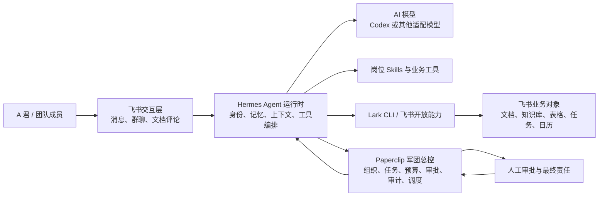

# Agent军团项目说明

文档状态：方向说明与第一阶段建设基线（v1.1，已根据交叉审核修订）
更新日期：2026-07-18
项目目录：agent-agent

## 1. 一句话定义

Agent军团是一套以飞书为工作入口、以 Paperclip 为组织与任务总控、以 Hermes 为智能体运行时、以 Codex 等 AI 工具为建设与执行能力的数字员工系统。

它的目标不是做一个"语音转录助手"，而是让 A 君能够像管理真实团队一样，创建、分工、调用、审核和维护一支持续工作的 AI 军团。

现有"小D - 视频转录助手"是军团中的第一个业务员工，也是验证整套体系能否真正交付结果的样板 Agent。

## 2. 为什么要做

单个 AI 助手可以回答问题，但很难稳定承担公司工作。真正可用的数字员工体系还需要解决：

- 谁负责什么，能访问哪些数据；
- 任务由谁接收、执行、交接和验收；
- 执行过程、成本、错误和结果是否可追踪；
- 新 Agent 如何申请上线，权限如何审核；
- Agent 失效、授权过期或工具异常后由谁发现和修复；
- 人在哪些关键节点审批、判断并承担最终责任。

Agent军团要建立的不是一批聊天机器人，而是一套有组织、有任务、有权限、有审计、有维护闭环的数字员工操作系统。

## 3. 目标用户与使用方式

第一阶段的主要用户是 A 君本人，后续可扩展给团队成员。

用户不需要进入复杂的技术后台发起日常工作。典型使用方式是：

1. 在飞书中找到对应岗位的 Agent，例如"小D - 视频转录助手"。
2. 直接发送链接、文件或任务要求。
3. Agent 自动判断工具、数据和执行流程，并在必要时请求授权或人工确认。
4. Agent 把结果交付到飞书文档、表格、任务或群聊中。
5. 军团总控记录任务状态、执行日志、成本、产物和异常。
6. A 君只在关键决策、风险操作或质量不达标时介入。

## 4. 项目边界

### 4.1 本项目要做

- 建立数字员工名册、部门、岗位、上下级和负责人关系；
- 为每个 Agent 定义职责、输入、输出、工具、权限和质量标准；
- 统一任务受理、调度、执行、交付、审核和失败处理；
- 接入飞书消息、群聊、文档评论等交互入口；
- 让 Agent 在授权范围内操作飞书文档、知识库、表格、任务等业务对象；
- 记录任务轨迹、工具调用、成本、审批和产物；
- 建立新 Agent 上线审核、运行监控和自动修复机制；
- 支持逐步增加数据组、内容组、管理组、实战组和运营组等部门。

### 4.2 本项目暂时不做

- 第一阶段不一次性创建截图中的全部 Agent；
- 不让所有 Agent 默认拥有 A 君的全部权限；
- 不绕过平台登录、付费、Cookie 或访问控制；
- 不让 Agent 自行完成付款、发布、删除、外发等高风险操作；
- 不把 Paperclip、Hermes、飞书或某个模型绑定为不可替换的唯一实现；
- 不把"能聊天"当作 Agent 已经可上线的标准；
- **不支持未在白名单内的来源平台**：第一阶段小D仅处理内部录制/知识库内容、以及明确授权公开的链接；来源白名单在小D岗位定义中维护，由配置而非 Agent 自行判断来限定合规边界。

## 5. 总体架构

这套架构分为四个职责清晰的层次。

### 5.1 飞书：军团的办公室

飞书负责人与 Agent 的交互，以及最终业务结果的承载。

- 通过飞书 Agent 集成能力接收单聊、群聊、文档评论等事件；
- 通过 Channel SDK 处理消息、卡片、流式回复和事件连接；
- 通过 Lark CLI 或开放 API 操作文档、表格、知识库、任务等；
- 每个数字员工可以表现为飞书侧栏中的独立岗位入口。

飞书不是 Agent 的大脑，也不负责长期记忆、任务治理和模型编排。

### 5.2 Hermes：数字员工的运行时

Hermes 负责让一个岗位真正持续运行：

- 加载岗位身份、提示词、知识、记忆和 Skills；
- 连接模型与业务工具；
- 隔离不同用户、任务和 Agent 的上下文；
- 执行多步骤任务、失败重试和结果回传；
- 支持在飞书等多个渠道中稳定工作。

Hermes 管"这个员工如何思考和做事"，不承担军团级组织治理。**Hermes 对岗位身份是只读加载，不在运行时修改岗位定义**——身份、职责、权限这些字段的唯一权威来源是 Paperclip，Hermes 侧的任何身份差异都应被视为需要同步的漂移，而不是可以本地维护的副本。

### 5.3 Paperclip：军团的组织与任务总控

Paperclip 适合作为 Agent军团的控制平面：

- 管理公司、部门、岗位、汇报关系和 Agent 身份，**是岗位身份定义的唯一权威来源**；
- 创建、分配、领取、转交和关闭任务；
- 通过 heartbeat 掌握 Agent 是否在工作、是否失联；
- 记录只写不可删的任务日志、工具调用和交付物；
- 管理预算、成本、审批、暂停和终止；
- 支持定时任务、Webhook 和 API 触发；
- 为多个 Agent 提供共享但隔离的工作状态。

Paperclip 不是聊天界面，也不是 Agent 推理框架。它不能替代 Hermes 和飞书，需要通过适配器把任务与执行状态连接起来。

### 5.4 Codex 与模型：建设工具和智能能力

Codex 的首要角色是 A 君和技术 Agent 的工程工作台，用于创建、修改、调试和维护军团及各岗位能力。运行时使用的模型可以根据任务成本、速度、上下文和质量要求选择，不应把整个系统锁死在单一模型上。

## 6. 两个必须闭环的核心流程

### 6.1 业务交付闭环

用户在飞书发起任务
→ 识别目标岗位与任务类型
→ 在 Paperclip 建立可追踪任务
→ Hermes 加载岗位身份、记忆和工具
→ Agent 执行业务步骤
→ 进行岗位质量检查
→ 写入飞书业务对象
→ 验证产物、目录和访问权限
→ 回复用户并记录任务结果、成本和异常
→ 必要时进入人工验收

"生成了内容"不等于"交付成功"。只有产物真实存在、权限正确、用户能够打开、任务状态有记录，闭环才算完成。

### 6.2 军团进化闭环

持续积累真实工作记录
→ Agent 架构师发现高频、重复或可自动化流程
→ 形成新岗位或能力升级申请
→ Agent 审核官检查权限、风险和职责冲突
→ 人工批准关键权限与上线
→ Codex / 技术 Agent 完成建设与测试
→ Paperclip 登记岗位、预算、负责人和运行策略
→ Agent 运维官监控授权、错误和健康状态
→ 根据交付质量继续改进或下线

这条闭环决定军团会不会越用越强，而不是越建越乱。

### 6.3 两类"审核"不是一回事

6.1 和 6.2 用了相似的词（验证、审核、审批），但校验的对象层级完全不同，容易被当成同一套机制来实现：

- **任务级校验**（6.1）：每一次具体任务的产物是否真实存在、权限是否正确、状态是否如实记录。这是代码层面的自动校验，必须在 M1 就存在，不依赖任何治理岗位上线。
- **组织级治理**（6.2）：一个新岗位或新权限要不要被批准上线。这是流程层面的审批，依赖 M2 才建立的审核官等角色。

第一阶段容易出现的误区是：以为"验证机制"要等 M2 治理三角建好之后才有。实际上任务级校验是 M1 的硬性验收条件（见 8.4），组织级治理才是 M2 的范畴。

## 7. 数字员工的标准定义

每个 Agent 上线前至少要有以下信息：

| 类别 | 必填内容 |
|---|---|
| 身份 | 名称、部门、岗位、负责人、汇报对象 |
| 职责 | 要解决的问题、允许接收的任务、明确非职责 |
| 输入 | 支持的消息、链接、文件、数据源和触发方式 |
| 输出 | 飞书文档、消息、表格、任务或其他可验证产物 |
| 能力 | 模型、Skills、CLI、API 和本地工具 |
| 权限 | 可读、可写、可外发的数据范围及有效期 |
| 质量 | 完成标准、检查清单、失败与降级规则 |
| 治理 | 预算、超时、重试、审批点、暂停与下线条件 |
| 运维 | heartbeat、日志、告警、负责人和恢复流程 |

只有角色提示词、没有工具和交付验证的，不算数字员工；只有脚本、没有职责和治理定义的，也不算完整 Agent。

## 8. 第一阶段：用小D跑通军团最小闭环

### 8.1 当前已有能力

当前仓库已经实现一个本地 Web 版"小D"原型：

- 接收公开 URL 或本地音视频文件；
- 优先获取字幕，失败后下载音频；
- 使用 mlx-whisper 等本地 ASR 转录；
- 调用可配置模型生成内容导览和分享式整理稿；
- 保留完整校对文本，避免把提纯误做成摘要；
- 创建飞书文档，并尝试给指定用户授予访问权限；
- 记录任务阶段、警告、结果路径和失败原因。

这些代码是"小D的业务能力原型"，还不是 Agent军团本身。

### 8.2 当前缺失能力

- 飞书消息入口和 Channel SDK 事件接入；
- Hermes profile、记忆、会话隔离和工具编排；
- Paperclip 中的组织、任务、heartbeat、预算和审计；
- Paperclip 与 Hermes 之间的任务/状态适配器；
- 标准化 Agent 注册清单、权限策略和上线流程；
- 审批、定时巡检、告警、暂停和下线机制；
- 多 Agent 之间的任务转交与产物引用；
- **产物与权限的二次验证器**：文档写入和权限授予后，用独立的只读调用二次确认结果（例如回查文档 ACL 中确实包含目标用户），不能只信任写入 API 的返回码。这是防止"假完成"的最后一道关卡，必须在 M1 落地，不依赖治理岗位上线。

### 8.3 第一阶段目标流程

A 君把音视频链接发给飞书里的小D
→ 小D确认收到并创建 Paperclip 任务
→ Hermes 调用现有转录流水线
→ 任务过程持续回写状态和 heartbeat
→ 小D创建飞书文档并验证权限（**首次对某用户授权前，经人工确认一次；确认无误、连续稳定运行后转为白名单自动执行**）
→ 飞书回复可打开的文档链接
→ Paperclip 保存任务轨迹、产物、耗时、成本和最终状态

### 8.4 第一阶段验收标准

- A 君只在飞书中发送一次链接即可发起任务。
- Paperclip 中能看到对应任务、负责人、状态和执行记录。
- Agent 中断后不会静默消失，能够标记失败、说明原因并安全重试。
- 最终交付的是可打开、目录正常、权限正确的飞书文档，且经过独立的二次校验确认，而非仅凭写入接口返回值判断。
- Paperclip 中保留文档链接、耗时、模型/工具使用和异常记录。
- 未配置或授权失败时明确降级，不伪造"已完成"。
- 凭据只保存在本机或受控密钥存储中，不进入日志、任务正文和文档。

第一阶段完成后，再复制同一套岗位模板建设其他员工。

## 9. 军团扩展顺序

建议按"先治理、再扩编"的顺序发展：

1. 小D - 视频转录助手：验证端到端业务交付。
2. 小维 - Agent 运维官：巡检 heartbeat、授权、任务失败和依赖版本。
3. 小审 - 飞书应用审核专员：审核新 Agent 权限和高风险动作。
4. 小佳 - Agent 架构师：分析工作记录，提出自动化机会和岗位升级建议。
5. 小牛 - 技术专家：处理复杂故障、适配器和工具链问题。

在治理闭环稳定后，再按真实业务频率扩展数据组、内容组、管理组、实战组和运营组。

扩编依据不是截图中有多少岗位，而是实际工作中是否存在稳定、重复、可验收的职责。

## 10. 非功能要求与默认假设

以下是第一阶段的默认假设，后续可根据真实使用数据调整。

**性能与规模**

- 初期服务 1 位主要用户和少量团队成员；
- 同时运行 3–10 个任务即可，不追求大规模公有云并发；
- 长音视频允许分钟级到小时级处理，但必须持续提供状态；
- 优先保证任务不丢和结果可信，再优化速度。

**安全与隐私**

- 默认本地或单组织部署，Paperclip 不直接暴露公网；
- 每个 Agent 使用最小权限，读写权限分开配置；
- 高风险动作必须人工审批；
- **权限到期后默认拒绝，不默认继续放行**——需要显式续期才能恢复访问，避免"过期权限因为没人发现而一直生效"；
- secret、token、Cookie 和授权链接不得进入提示词、聊天、日志或文档；
- 涉及聊天记录、会议纪要和私人文档的架构分析能力必须单独授权并可撤销。

**可靠性**

- 每个任务拥有唯一 ID、明确状态和可重试边界；
- 外部接口失败时记录真实原因，不把部分成功标记为完整成功；
- heartbeat 只证明 Agent 存活，产物验证才证明业务完成；
- 关键任务需要幂等或去重，避免重试导致重复文档、重复发布或重复通知；
- **长任务需支持基于 heartbeat 的断点续传**：已完成的处理片段（如已转录的音频分段）不因下一次 heartbeat 唤醒而重新执行，避免长音视频任务在多次 heartbeat 之间重复计费。

**维护与所有权**

- A 君是业务标准、权限和高风险决策的最终负责人；
- Agent 架构师负责发现机会，不自动批准自身扩权；
- Agent 审核官负责上线和权限审查；
- Agent 运维官负责日常健康与授权巡检；
- 技术 Agent 或 Codex 工作台负责代码、适配器和复杂故障。

## 11. 关键风险

| 风险 | 表现 | 控制方式 |
|---|---|---|
| 权限过大 | 单个 Agent 可读取或外发全部资料 | 最小权限、分 profile、到期默认拒绝、显式续期、审批 |
| 假完成 | 回复成功但文档不可用或任务已中断 | 产物和权限二次验证（独立只读回查）、状态回写、只写不可删的操作日志 |
| 上下文串线 | 不同用户或任务的数据混在一起 | 会话与任务隔离、明确身份和工作区 |
| 无限循环与成本失控 | Agent 重复执行或长期占用模型；长任务在多次 heartbeat 之间重复执行已完成片段导致重复计费 | 预算、超时、最大重试、人工暂停、heartbeat 断点续传/幂等设计 |
| 军团膨胀 | Agent 数量很多但职责重叠、无人维护 | 岗位准入、真实任务量验证、定期下线 |
| 平台依赖 | 飞书、模型或框架变化导致全军失效 | 分层适配、可替换模型、版本与健康巡检 |
| 敏感信息泄漏 | 凭据或私人内容进入日志和提示词 | 受控密钥存储、脱敏、访问审计 |

## 12. 建设里程碑

**M0：项目归位**

- 本文成为项目目标基线；
- 明确现有仓库是小D业务原型，不是完整军团；
- 建立 Agent、任务和权限的标准定义。

**M1：小D接入飞书与Paperclip**

- 建立飞书小D应用和消息入口；
- 建立 Hermes 小D profile；
- 将现有转录流水线封装为可调用能力；
- 完成 Paperclip 任务、heartbeat、结果和日志回写；
- 落地产物与权限的二次验证器；
- 跑通一次真实链接到飞书文档的完整验收。

**M2：建立治理三角**

- 上线运维官、审核官、架构师（**这三个治理岗位的上线由 A 君直接人工审批，不进入自动化审核链条**——审核官自身尚未存在时无法审核自己的上线，避免审核逻辑自我循环）；
- 建立权限申请、上线审核、健康巡检和异常处置；
- 为高风险动作增加人工审批。

**M3：按业务部门扩编**

- 从真实任务记录中选择第二批高价值岗位；
- 支持 Agent 间任务转交和共享产物；
- 建立成本、质量和节省时间的部门级看板。

**M4：形成持续进化系统**

- 自动发现重复工作与能力缺口；
- 用真实交付数据评估新 Agent 和岗位升级；
- 对低价值、长期失败或职责重叠的 Agent 自动提出整改或下线建议。

## 13. 成功指标

军团是否成功，不看 Agent 数量和 Token 消耗，而看真实工作结果：

- 端到端任务成功率；
- 产物可访问且通过质量检查的比例；
- 人工介入次数及介入原因；
- 平均完成时间、失败恢复时间和单任务成本；
- 重复任务被自动化后的时间节省；
- 权限、泄密、重复发布等安全事故数量；
- 每个岗位的真实使用频率和持续价值。

## 14. 已确认的架构决策

| 决策 | 备选方案 | 选择理由 |
|---|---|---|
| Paperclip 作为军团控制平面 | 自建完整总控；只用飞书聊天列表 | 已具备组织、任务、heartbeat、预算、审批和审计能力，可减少重复建设 |
| Hermes 作为 Agent 运行时 | Paperclip 直接承担推理；每个 Agent 单独写脚本 | Hermes 更适合承载身份、记忆、上下文和工具编排，与总控职责分离 |
| 飞书作为主要工作入口和交付面 | 另做独立聊天产品 | A 君和团队的真实协作、文档与任务已经发生在飞书中 |
| Codex 主要作为建设与运维工作台 | 将 Codex 固定为所有 Agent 的唯一运行模型 | 保留模型选择空间，同时利用 Codex 的工程能力建设军团 |
| 小D作为第一个样板员工 | 一次性搭建全部岗位 | 小D已有代码和清晰验收标准，最适合验证完整闭环 |
| 先建立治理岗位，再大规模扩编 | 先复制几十个业务 Agent | 权限、故障和职责重叠会随 Agent 数量快速放大 |
| 保留现有转录代码作为能力模块 | 推翻后完全重写 | 已有下载、ASR、整理、飞书交付和真实性降级逻辑，可复用并逐步封装 |
| 暂不把 OpenClaw 设为既定核心 | 立即替换 Hermes；同时叠加两个运行时 | OpenClaw 更适合持续在线、常驻式的执行场景，而 M1 只需要事件触发式（用户发链接才启动）；等出现需要 7×24 巡检的岗位（如小维运维官）时，再评估是否用 OpenClaw 承载该类岗位 |
| MCP 按共享需求渐进引入 | 所有工具立即重写为 MCP | MCP解决工具与上下文交换，不替代岗位治理、任务状态和业务验收 |

## 15. 参考资料

- 本地资料：/Users/pengaro/Downloads/agent资料/agent军团.png
- 本地资料：/Users/pengaro/Downloads/agent资料/小D转录助手.png
- 本地资料：/Users/pengaro/Downloads/agent资料/主播分享的内容.txt
- 本地资料：/Users/pengaro/Downloads/agent资料/小D复制部署说明：音视频转录整理 Agent.md
- 飞书 Agent 集成能力概览
- Paperclip 开源项目
- 推测内容的证据分级与采纳结果：docs/standards/AI推测内容评估与采纳.md
- 当前小D原型说明：apps/xiaod-media-transcriber/README.md

## 16. 修订记录

**v1.1（本次修订）** —— 基于交叉审核，共 8 处修订：

1. 明确岗位身份的唯一权威来源是 Paperclip，Hermes 只读加载（5.2、5.3）。
2. 8.2 增补"产物与权限二次验证器"，并将"不可变日志"改为更准确的"只写不可删的操作日志"（5.3、8.2、11）。
3. 8.3 流程中为首次授权动作增加人工确认点，稳定后转白名单自动执行。
4. 10、11 增补长任务基于 heartbeat 的断点续传/幂等设计要求，防止重复计费。
5. 新增 6.3，区分"任务级校验"与"组织级治理"两套不同层级的审核机制，避免误以为任务级验证要等 M2 才存在。
6. M2 增补治理岗位冷启动说明：前三个治理岗位由 A 君直接审批，不进入自动化审核链条。
7. 10 节安全与隐私增补权限到期默认拒绝、需显式续期。
8. 14 节修正 OpenClaw 决策理由，从"信息不足"改为基于场景（常驻式 vs 事件触发式）的判断依据。

---

这份文档是后续设计和开发的判断基线：任何功能都应该回答它属于哪个岗位、进入哪条任务闭环、需要什么权限、如何验收、失败由谁处理。无法回答这些问题的功能，不应直接加入军团。
