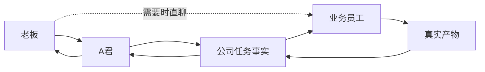
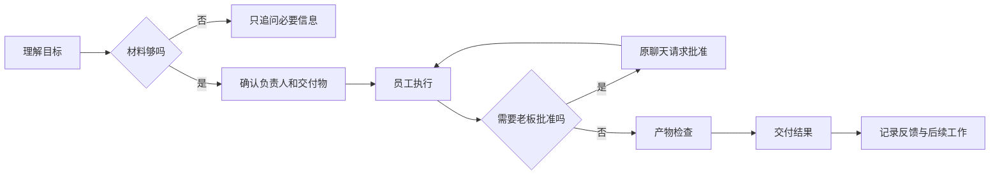
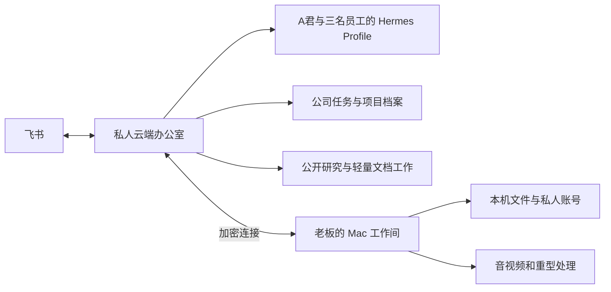

# 数字员工公司体验设计

| 字段 | 内容 |
| --- | --- |
| 状态 | 已实施；本机三名业务员工与六名治理员工独立入口均通过，云端为未来可选项 |
| 负责人 | A 君 |
| 确认日期 | 2026-07-26 |
| 关联 PRD | [Agent军团总纲](../../tasks/prd-agent-army-master.md) |
| 关联架构 | [Agent军团系统架构](../architecture/system-architecture.md) |
| 当前实现依据 | [ADR-0007](../adr/0007-hermes-native-feishu-runtime-and-agent-army-mcp.md) |

> 本文定义目标体验。当前已完成 A君统筹三名业务员工的本机总任务闭环，以及创建官、任务协调官、审核官、架构师、运维官、技术专家六名治理员工的独立 Hermes Profile、岗位 Skill/MCP、Paperclip 身份和真实飞书私聊。私人云桥接只做了隔离验证；用户已选择先在本地 Mac 运行，未启用云结算。

## 1. 理解摘要

- 产品不是机器人列表，而是一家能够接受老板目标并真实交付工作的数字员工公司。
- 用户是老板，只负责目标、优先级、资源和关键决策，不负责选模型、写命令、转述上下文或协调执行步骤。
- A君是主要入口和总管，负责理解目标、分派员工、跟踪进度、处理普通异常、组织验收并统一汇报。
- 业务员工拥有独立身份、连续会话、岗位记忆和工具权限；用户需要时可以直接找员工派活。
- 无论任务从 A君还是员工入口发起，都必须关联同一任务事实、阶段、审批和产物。
- 业务员工按任务工作；A君和后台管理岗位可以主动巡检、催办和处理故障。
- 第一版采用 A君加三名真实业务员工，同时最多处理三项工作。

## 2. 为什么建设

现有“一个机器人对应一组命令”的体验仍要求用户承担协调工作。目标体验要求系统把自然语言目标转化为真实工作：确定负责人、补齐必要信息、执行、检查产物、处理失败、请求必要审批并交付最终结果。

成功标准不是“每个机器人都能回复”，而是：

1. 用户可以只向 A君交代多个目标；
2. A君自行分派、追踪和处理依赖；
3. 每名业务员工能独立完成一项真实工作；
4. 用户直接找员工和找 A君看到同一任务与结果；
5. 失败、重启、拒绝审批和部分完成均不会产生虚假成功；
6. 最终交付物可以直接阅读或继续使用。

## 3. 用户与使用范围

### 3.1 当前用户

- 主要用户：一位公司负责人；
- 后续用户：负责人明确授权的少量内部成员；
- 日常入口：飞书私聊，必要时使用受控协作群。

### 3.2 明确非目标

- 第一版不建设二十名以上员工或多个部门；
- 不强迫老板每天面对全部治理岗位；治理员工有独立飞书身份，但只在需要时直聊或显示；
- 不让每名员工各自维护一套任务队列、审批系统或项目数据库；
- 不以云端部署代替第一批员工的真实业务验收；
- 不承诺员工可以完成任何陌生目标；
- 不允许员工自行登录、公开发布、付费、删除或扩大权限。

## 4. 已确认的组织模型

### 4.1 老板

老板提出目标、决定优先级、提供必要资源并处理高风险或业务判断。老板不需要知道内部模型、工具、任务路由和运行服务。

### 4.2 A君·军团总管

A君负责：

- 理解老板目标；
- 判断是否需要补充信息；
- 确定交付物和负责人；
- 拆分、分派和协调任务；
- 跟踪阶段与依赖；
- 调用后台管理能力；
- 汇总结果、异常和待决策事项；
- 保持员工直聊和总管入口的一致性。

A君不替代专业员工执行具体领域工作，也不建立第二套公司任务真相。

### 4.3 首批三名业务员工

#### 小D｜素材整理员工

- 输入：音频、视频、公开链接或获准的本机素材；
- 工作：素材获取、转录、结构化整理和内容提炼；
- 交付：带来源、正文、摘要和结构的飞书文档或附件；
- 边界：不负责广泛调查、公开发布和账号操作。

#### 资料研究员｜信息调查员工

- 输入：明确问题、研究范围和期望决策；
- 工作：检索公开网页、GitHub和其他公开资料，比较来源并识别证据缺口；
- 交付：带来源、结论、不确定项和行动建议的研究报告；
- 边界：默认不登录账号、不读取私密内容、不把搜索结果堆砌成报告。

#### 办公执行助理｜文档与事务员工

- 输入：老板提供的材料、其他员工产物或明确的办公目标；
- 工作：整理文档、表格、任务清单、会议材料和统一汇报包；
- 交付：可以直接阅读、审阅或继续执行的办公产物；
- 边界：不得擅自外发、公开发布或代替老板作业务决策。

### 4.4 后台管理岗位

创建官、任务协调官、审核官、架构师、运维官和技术专家都有独立飞书联系人，但平时由 A君幕后调度，只在老板需要时直聊或显示：

- 任务协调官负责把目标拆成清晰分工、依赖和交付顺序；
- 运维官检查运行、连接和任务异常并执行低风险恢复；
- 审核官检查产物是否存在、可打开、完整且权限正确；
- 架构师只在复杂任务拆分或能力缺口时介入；
- 技术专家在安全恢复失败后调查技术问题；
- 创建官只在确认存在稳定岗位缺口时准备新员工方案。

这些岗位的动作必须留下可追踪记录。老板可以直接私聊每个岗位；通过 A君交办时，只有需要老板批准、判断或知晓重要异常，A君才显示介入角色和结论。

## 5. 推荐架构：一人一档案，一家公司一本账

### 5.1 采用方案

每名正式员工拥有独立 Hermes Profile、身份、会话、岗位记忆和工具权限。公司任务、项目事实、审批和产物通过统一任务编号关联。员工之间不复制完整私人聊天，也不各自建设任务系统。

### 5.2 未采用方案

| 方案 | 不采用原因 |
| --- | --- |
| 只有 A君 是长期 Agent，员工按任务临时生成 | 员工缺少稳定身份、关系、岗位记忆和直聊体验，本质仍是一个机器人切换角色 |
| 每名员工完全独立维护任务、记忆和审批 | 会形成多套任务真相、审批冲突、重复记忆和高维护成本 |

## 6. 信息与记忆边界

| 信息类型 | 真相归属 | 使用规则 |
| --- | --- | --- |
| 当前聊天与连续指代 | 对应员工的 Hermes Session | 只属于当前员工与获准会话 |
| 用户稳定偏好与岗位经验 | 对应员工的 Hermes Profile Memory | 一次性修改不得自动升级为长期偏好 |
| 项目目标、正式资料与已确认决策 | 公司共享项目档案 | 按任务和岗位权限提供，不复制全部私人聊天 |
| 负责人、阶段、审批、失败与产物 | 公司任务事实 | 统一任务编号关联，所有入口读取同一结果 |
| 业务 checkpoint 与原始产物 | 对应业务 Agent / A君业务存储 | 任务系统只保存必要引用，不覆盖安全断点 |
| 组织、岗位、预算和组织级审计 | Paperclip | A君和 Hermes 不复制组织级控制面 |

不新增“短期记忆、长期记忆、项目记忆”三套平行数据库。Hermes负责人和会话记忆，公司系统负责项目及任务事实。

### 6.1 反馈如何沉淀

- 当前任务的一次性修改只影响当前任务；
- 稳定的个人偏好可以进入对应员工记忆；
- 可复用的公司工作标准进入正式项目或岗位规则；
- 会改变权限、外部行为或成本的学习必须由老板批准；
- 员工记忆与最新正式资料冲突时，以正式资料和老板最新明确决定为准。

## 7. 工作流程

### 7.1 接单

- 约十秒内说明理解、负责人和预期交付物；
- 没有明确目标时不创建任务；
- 缺少材料时只追问一个最影响执行的问题；
- 复杂目标可以拆分，但第一版同时最多执行三项。

### 7.2 执行与协作

- 直接找员工派活时，员工登记同一公司任务，A君可见但不无故干预；
- 员工发现超出岗位时，保留已有上下文并交给 A君重新分派；
- 多员工协作通过任务目标、材料引用、阶段和产物协作，不通过人工复制聊天；
- 普通内部阶段不向老板刷屏。

### 7.3 审批

以下动作执行前必须暂停并在原飞书聊天请求老板决定：

- 登录或使用新的私人账号连接；
- 对外发送；
- 公开发布；
- 付费或增加预算；
- 删除；
- 扩大权限或数据范围。

公开资料读取、内部分析、本地处理和创建仅老板可见的飞书文档可以自动完成。

### 7.4 交付

最终交付必须包含：

- 完成结论；
- 可访问的产物入口；
- 未完成项；
- 异常和恢复情况；
- 需要老板决定的事项；
- 必要时的下一步建议。

部分完成不得显示为完整成功。

## 8. 飞书体验

### 8.1 主要联系人

- A君·军团总管；
- 小D·素材整理；
- 资料研究员；
- 办公执行助理。

用户使用自然中文，不需要学习固定命令。任务编号、模型、工具调用和内部日志默认隐藏，需要追查时再展开。

### 8.2 通知原则

员工只在以下情况通知老板：

- 缺少继续工作所必需的材料；
- 需要高风险审批；
- 故障无法自行安全恢复；
- 必须由老板做业务取舍；
- 工作完成并交付结果。

### 8.3 主动汇报

A君每天最多提供两次管理汇报：

- 开始工作时：今日目标、负责人和等待老板事项；
- 工作结束时：已完成、进行中、阻塞、产物和下一步。

没有重要变化时不刷屏。

## 9. 性能、规模与维护要求

### 9.1 第一版规模

- 一位主要老板；
- A君加三名真实业务员工；
- 同时最多执行三项工作；
- 后台管理岗位按需触发，不计入业务员工名额。

### 9.2 响应

- 约十秒内确认理解和负责人；
- 约一分钟内进入真实执行或明确说明等待条件；
- 长任务只在真实关键阶段更新；
- 不使用虚假百分比或无事实的“正在努力”。

### 9.3 维护

- A君自动监控、重连并执行已批准的低风险恢复；
- 程序升级、配置变化、权限变化和显著费用变化必须由老板批准；
- 系统不得要求老板日常手工启动多个后台服务。

## 10. 混合在线架构

最终目标采用“私人云端办公室 + Mac工作间”：

### 10.1 私人云端办公室

- 飞书全天收发；
- A君和员工的连续会话；
- 任务排队、分派和状态；
- 公开资料研究及轻量文档工作；
- 审批、汇报和加密备份。

云端可以保存受控的会话、岗位记忆、任务摘要和公开资料。

### 10.2 Mac工作间

- 本机文件；
- 私人网站和软件登录态；
- 音视频及其他重型处理；
- 不适合上传云端的敏感工作。

密码、Cookie、完整浏览器会话和未经批准的本机文件不得同步到云端。Mac离线时，依赖本机的任务显示为等待；Mac上线后通过加密连接领取并从安全阶段继续。

### 10.3 分阶段边界

第一阶段已在当前本机环境证明四个角色的真实工作闭环，并在隔离云端模式证明 `等待 Mac → 短租约领取 → 心跳 → 验证产物回写`。下一阶段才把同一部署包放到真实私人云主机；没有通过真实关机后飞书验收前，不以配置文件或进程存活替代全天在线证明。

## 11. 异常与恢复

| 场景 | 预期行为 |
| --- | --- |
| 目标模糊 | 只追问一个关键问题；不明确时不创建任务 |
| 派错员工 | 保留已有上下文并交给 A君重新分派 |
| 员工忙碌或离线 | 进入真实队列并说明顺序，不伪造执行中 |
| 重复消息 | 返回原任务，不重复建任务、建文档或产生费用 |
| 同时找 A君和员工 | 用统一任务编号合并，老板最新明确决定优先 |
| 资料无法确认 | 标注未知、证据和缺口，不编造来源 |
| 审批拒绝或过期 | 停止目标动作，不得换工具绕过 |
| Mac离线 | 本机任务等待，云端继续独立部分 |
| 普通失败 | 从安全阶段自动恢复一次 |
| 再次失败 | 后台运维官或技术专家接手；无法安全解决才通知老板 |
| 部分完成 | 分列已完成、未完成和可交付部分 |
| 服务重启 | 从持久阶段继续，不重复已确认外部动作 |

## 12. 验收设计

### 12.1 单员工真实交付

1. 小D完成一项真实音视频或素材整理并交付可读文档；
2. 资料研究员完成一项真实公开资料调查并交付带来源报告；
3. 办公执行助理完成一项真实材料整理并交付可用文档、表格或汇报包。

### 12.2 A君统筹

老板一次交代三件不同工作。A君自行分派、跟踪和处理异常，最终统一汇报负责人、结果、产物、异常和待决策事项。老板不手工指定模型、工具或内部流程。

### 12.3 一致性

同一任务分别从 A君和员工聊天查询，必须返回一致状态和结果。员工更新后，A君不得继续汇报旧结果。

### 12.4 恢复与安全

- 执行中重启服务，任务从安全阶段继续且不重复交付；
- Mac离线时本机任务等待，上线后自动继续；
- 拒绝一次外发或发布审批，确认目标动作未发生；
- 制造一次受控故障，验证安全恢复、后台技术介入和最终通知。

### 12.5 四层证据

| 层级 | 必须证明 |
| --- | --- |
| 自动化 | 契约、状态、幂等、权限和恢复逻辑 |
| 当前运行 | 正确进程、工作目录、连接、任务和产物 |
| 外部平台 | 真实飞书消息、审批和原会话交付 |
| 人工验收 | 老板能阅读并确认产物可用 |

四层全部通过后，员工才能标记为正式上岗。

## 13. 假设

- 第一阶段只有一位主要老板和少量获准内部用户；
- 老板接受受控会话、员工记忆、任务摘要和公开资料保存在私人云服务器；
- 密码、Cookie、本机文件和敏感账号连接继续只保存在 Mac 或对应受控环境；
- 首批三名员工为小D、资料研究员和办公执行助理；
- 第一阶段先证明本机真实闭环，云端常驻在后续阶段实施；
- 飞书继续作为日常入口，A君网页只作为授权、诊断和应急入口。

## 14. 决策记录

| 编号 | 决策 | 替代方案 | 选择原因 |
| --- | --- | --- | --- |
| D-01 | A君为主要入口，所有正式员工可按需直聊 | 只允许找 A君；老板逐个管理员工 | 同时保留老板视角和直接找专业员工的效率 |
| D-02 | 采用混合工作模式 | 全部被动；全部主动 | 业务员工聚焦交付，管理岗位主动巡检但不越权 |
| D-03 | 第一阶段建设通用助理团队 | 立即建设1688、内容或研发部门 | 先证明跨任务的员工组织体验 |
| D-04 | 第一条闭环是 A君统筹多项工作 | 只验收单员工聊天 | 直接证明分派、跟踪、异常和统一汇报 |
| D-05 | 低风险内部动作自动，高风险动作审批 | 所有动作审批；高度自主 | 减少老板打断，同时保护账号、外发、费用和权限 |
| D-06 | 当前先本地 Mac；需要全天在线时再选择私人云端办公室加 Mac工作间 | 立即上云；全部云端 | 先保证本机员工体验，云端费用和迁移另行授权 |
| D-07 | 第一版 A君加三名员工、最多三项并行 | 六至十名；二十名以上 | 用少量真实交付避免堆积空壳身份 |
| D-08 | 后台管理岗位拥有独立联系人，但只在需要时显示或直聊 | 强迫老板每天逐个管理 | 保持老板界面简单，同时保留真实员工感与可追踪管理能力 |
| D-09 | 只在阻塞、审批、重要异常、业务判断和交付时通知 | 每阶段汇报；只做每日汇总 | 降低噪声并保留必要介入点 |
| D-10 | 约十秒确认、约一分钟开始、关键阶段更新 | 只给最终结果；持续刷屏 | 提供可预期反馈且不伪造进度 |
| D-11 | 安全恢复一次，再交后台技术岗位 | 直接失败；无限重试 | 控制重复副作用、费用和故障升级 |
| D-12 | A君自动低风险维护，升级与权限变化审批 | 全手工；全部自动升级 | 降低日常维护负担并防止未经确认的系统变化 |
| D-13 | 每人独立 Hermes Profile，公司共享任务事实 | 临时子 Agent；每人完整独立系统 | 保留员工身份和记忆，同时避免多套任务真相 |
| D-14 | 使用 Hermes 人员记忆，不另造三套记忆库 | 自研短期、长期和项目记忆数据库 | 复用成熟运行时并保持项目与任务事实边界 |

## 15. 当前实施结论

1. 本机数字员工公司的身份、会话、职责、Skill/MCP、统一任务事实和真实飞书入口已落地；
2. 新员工由 Manifest 与 Hermes Profile 映射驱动，模型授权、治理运行时和验收不再维护第二份岗位白名单；
3. A君控制台复用小D通用账号连接管理，只展示脱敏状态与撤销，不接收 Cookie 或 Token；
4. 新员工仍必须经过岗位定义、最小权限、受限测试和真实飞书验收，不能只复制 Profile 就宣称上岗；
5. 当前正式部署只在本地 Mac；关机即离线。未来常在线部署需要重新获得费用和迁移授权。
