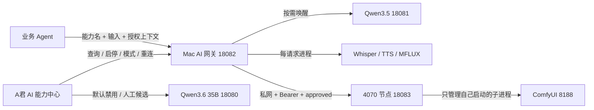

# A君 AI 能力控制设计

## 边界

A君提供本机组件控制与诊断，不复制 Paperclip 的组织、任务和审批控制面。Agent 调用的是能力名，不接触 `launchctl`、Windows 计划任务、模型路径、Bearer token 或 ComfyUI 工作流。

Mac 能力实现通过独立插件运行时提供。A君只展示活动插件版本、运行状态和固定动作，不展示项目 checkout 或要求用户维护仓库内 venv；插件升级/回滚不改变业务 Agent 的能力入口。

## 控制链路

## 接口

- `GET /v1/control`：只读快照，不唤醒重模型。
- `POST /v1/control/services/{serviceId}/{action}`：固定白名单服务与动作；动作仅允许 `start`、`stop`、`restart`、`reconnect`。
- `PUT /v1/control/services/{serviceId}/policy`：模式只允许 `on_demand`、`always_on`、`disabled`；空闲时长有上下限。
- A君仅在本机请求中代理这些接口，浏览器不获得 Windows token。

## 路由与替代

每个能力登记有序 provider。路由器先检查岗位能力白名单和数据边界，再检查策略与健康。`on_demand` provider 可在真实调用时启动，普通状态查询不可启动。fallback 结果必须带 `fallbackFrom`，审计记录实际节点。

首批有效路由：

- 图片生成/编辑：4070 ComfyUI（经批准）→ Mac MFLUX。
- 文本/视觉/视频：Mac Qwen3.5；服务失败时先进行一次受控重启，未登记第二模型时明确失败。
- Qwen3.6 35B 仅是用户可见的禁用候选，不自动接管文本、视觉或视频路由。
- ASR：Mac Whisper；进程级失败直接退出并明确失败，后续接入 Qwen3-ASR 时作为第二 provider。
- TTS：Mac Qwen3-TTS；每请求进程，无后台服务。
- 检索：Embedding / Reranker 按需加载；无任务时释放。

## 安全约束

- 服务 ID、label、命令和路径均由代码静态登记，HTTP 请求不得携带任意命令。
- Mac 控制接口只绑定回环地址；A君的写操作还要求请求来自本机。
- Windows 控制接口复用 CIDR allowlist 与 Bearer 校验。
- Windows 停止动作只针对节点记录的子进程；若 8188 是外部进程，状态显示“外部运行”，不可由 A君停止。
- 配对 token 继续只从受限文件加载，界面与日志不回显。
