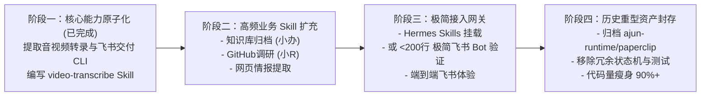

# Agent军团轻量 Skill 驱动瘦身改造计划

| 字段 | 内容 |
| :--- | :--- |
| **计划名称** | Agent军团轻量 Skill-Driven 架构演进与瘦身计划 |
| **状态** | 进行中 (阶段一 PoC 验证已通过) |
| **负责人** | 技术负责人 / A君 |
| **实验分支** | `feat/skill-driven-lightweight-poc` |
| **核心目录** | `skills/`、`tools/` |
| **创建日期** | 2026-08-29 |

---

## 1. 改造背景与核心痛点

当前仓库在长期迭代中积累了 **33.4 万行代码**（1630 个文件），形成了庞大的“重型单体平台与状态机架构”：
1. **状态机过度设计**：`apps/ajun-runtime`（17.2 万行）自建了 TaskService、SQLite WAL 存储、多重审批拦截、不可变 Release 管理等复杂控制面，80% 的代码在维护状态同步与数据一致性。
2. **测试包袱沉重**：为保证状态机与边界不崩溃，维护了 11.2 万行的回归测试与 Mock 固件。
3. **冻结资产冗余**：M5 16 阶段内容自治流水线、Publisher Gateway、Remotion 自动渲染等重型模块目前大多处于冻结或按需状态，却占据了约 8 万行代码。

**现代 Agent 演进趋势**：
以 Claude 3.7、GPT-4.5、StepFun 3.7 为代表的大模型已经具备强大的自主任务规划、工具调用（Function Calling）与错误自愈能力。**我们不需要在外部用数十万行代码硬编码复杂的调用链，而应将编排权交给 LLM，代码只提供原子化工具（CLI/Skill）与标准化 SOP（`SKILL.md`）。**

---

## 2. 改造总体原则

1. **减法优先 (Subtraction First)**：能用一个 CLI 脚本或一个 SOP 解决的问题，绝不引入类继承、工厂模式与跨进程状态机。
2. **双轨并行 (Zero-Disruption Dual Track)**：在独立分支 `feat/skill-driven-lightweight-poc` 进行改造，主分支与现行 4321 运行态保持原样，零业务中断风险。
3. **能力原子化 (Atomic & Composable)**：每个工具独立为单个自包含脚本，输入输出标准化为 JSON 或文件路径，不产生隐式上下文依赖。
4. **SOP 规范驱动 (Skill as Code)**：所有业务工作流写为标准的 `SKILL.md`，包含清晰的触发条件、执行步骤与提示词模板。

---

## 3. 四阶段实施路线图



---

### 阶段一：核心业务能力提取与验证 (已完成 ✅)

- **目标**：将最核心的小D音视频整理链路抽离为原子工具与标准 Skill。
- **交付清单**：
  - [`tools/fetch-media.mjs`](file:///Users/pengaro/Documents/work/codeDevelop/ideaSpace/agent-agent/tools/fetch-media.mjs)：音视频/B站原生字幕抓取（185 行）。
  - [`tools/transcribe-whisper.py`](file:///Users/pengaro/Documents/work/codeDevelop/ideaSpace/agent-agent/tools/transcribe-whisper.py)：基于本地 faster-whisper 的离线 ASR 转录（128 行）。
  - [`tools/create-feishu-doc.mjs`](file:///Users/pengaro/Documents/work/codeDevelop/ideaSpace/agent-agent/tools/create-feishu-doc.mjs)：飞书 docx 文档创建与批量 Block 写入（186 行）。
  - [`skills/video-transcribe/SKILL.md`](file:///Users/pengaro/Documents/work/codeDevelop/ideaSpace/agent-agent/skills/video-transcribe/SKILL.md)：音视频转录与飞书整理 SOP 技能标准文件（65 行）。
- **验证结果**：
  - 本地 ASR 转录 0.53s 冒烟通过；
  - 媒体提取与飞书参数校验通过；
  - 链路代码从 18.4 万行压缩至 564 行。

---

### 阶段二：扩充高频业务 Skill 矩阵 (进行中 🔄)

- **目标**：将其他数字员工（小办、小R、小牛等）的高频工作流提炼为 Skill。
- **实施计划**：
  1. **知识库归档 Skill (`skills/office-knowledge-archive/`)**：
     - 工具：`tools/sync-knowledge-vault.mjs`（读写本地/统一内容库与飞书 Wiki）。
     - SOP：将会议纪要、调研文档自动整理并归档到目标知识空间。
  2. **GitHub 与开源调研 Skill (`skills/github-research/`)**：
     - 工具：`tools/github-search.mjs`（调用 GitHub REST API 获取 Repo、Commit 与 Release）。
     - SOP：自动对比开源项目热度、成熟度并生成分析报告。
  3. **网页深度提取 Skill (`skills/web-extractor/`)**：
     - 工具：`tools/fetch-web-article.mjs`（提取微信公众号、知乎、技术博客正文）。
     - SOP：清洗广告并输出标准化 Markdown。

---

### 阶段三：极简 Agent 接入与飞书端到端联动 (待开始 ⏳)

- **目标**：打通用户在飞书中直接通过 Skill 调度完成任务的极简入口。
- **实施路径**：
  - **路径 A（继续使用 Hermes）**：
    - 将 `skills/` 软链接至 Hermes 的 Skills 共享目录；
    - 在 Hermes Profile 中声明角色（如小D）并允许调用对应 Skill；
    - 验证飞书单聊中发送视频链接，Hermes 自主调度 `tools/` 完成交付。
  - **路径 B（超轻量自研飞书服务，备选）**：
    - 编写一个单文件 `server.mjs`（< 200 行），监听飞书 WebSocket/Webhook；
    - 将消息直接包装为 Prompt 发送给 StepFun 3.7 / Claude 并注入 Tools 定义；
    - 模型决策执行 CLI 后直接发回飞书。

---

### 阶段四：历史资产归档与工程终态收口 (待开始 ⏳)

- **目标**：彻底丢掉历史包袱，完成代码库终态瘦身。
- **实施计划**：
  1. **资产归档**：
     - 将 `apps/ajun-runtime`、`integrations/paperclip`、`integrations/publishing`、`apps/boom-monitor` 移入 `archive/` 或独立分支冷备份。
  2. **配置重构**：
     - 精简根目录 `package.json`，移除冗余 npm workspace 脚本；
     - 移除 72 小时稳定性观察器与复杂的不可变 release 打包脚本。
  3. **代码量收敛目标**：
     - 仓库总代码量从 **33.4 万行** 降至 **2,000 ~ 3,000 行**；
     - 核心结构简化为：
       ```text
       agent-agent/
       ├── skills/               # 业务技能标准库 (SKILL.md)
       ├── tools/                # 原子 CLI 脚本 (fetch, asr, docx, search)
       ├── docs/plans/           # 演进计划与关键决策
       └── server.ts             # 极简接入入口
       ```

---

## 4. 验证阶梯与门禁标准

| 阶段 | 验证层级 | 验收标准 |
| :--- | :--- | :--- |
| **阶段一** | 本地 CLI 冒烟 | 3 个 CLI 脚本独立运行无报错，输出标准 JSON / 产物文件 |
| **阶段二** | 多技能覆盖 | 归档、调研、网页提取 Skill 各自完成 1 条真实用例测试 |
| **阶段三** | 飞书真实交互 | 飞书发送真实 B站/YouTube 链接，2 分钟内收到生成的飞书文档链接 |
| **阶段四** | 瘦身与构建 | `git status` 清爽，全量依赖极简安装，无冗余后台进程与死锁风险 |

---

## 5. 风险控制与回滚预案

1. **生产环境零干扰**：
   - 改造全程在 `feat/skill-driven-lightweight-poc` 分支进行；
   - 现行 `4321` 生产 launchd 守护进程运行在不可变 release 目录，不受实验分支任何修改影响。
2. **快速回滚机制**：
   - 随时可以通过 `git checkout main` 一键切回原有生产架构。
3. **凭据安全**：
   - 所有脚本统一通过 `process.env` 读取配置，测试数据一律使用 `/tmp/` 隔离目录，禁止任何密钥或私人文件提交。
